# Practica de Laboratorio - Extraer un ejecutable de un PCAP
## Objetivos
Analizar registros es muy importante, pero también lo es comprender de qué manera suceden las transacciones de red al nivel de los paquetes.
En esta práctica de laboratorio analizará el tráfico de un archivo pcap previamente capturado y extraerá un ejecutable del archivo.

---
### Parte 1: Analizar archivos de registros precapturados y capturas de tráfico

Se realiza toda esta practica, dentro de la VM de CyberOps.

1. Cambie de directorio para ingresar a la carpeta `lab.support.files/pcaps`, y genere un listado de los archivos con el comando `ls –l`.

    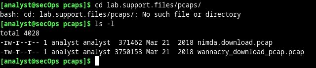 
    <em>Paso 1a.</em>

2. Emita el siguiente comando para abrir el archivo `nimda.download.pcap` en Wireshark.

    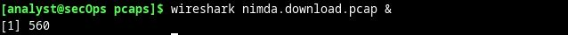 
    <em>Paso 1b.</em>

3. El archivo `nimda.download.pcap` contiene la captura de paquetes relacionadas con la descarga de malware que se realizó en la práctica de laboratorio anterior. El pcap contiene todos los paquetes enviados y recibidos mientras se estaba ejecutando tcpdump. Seleccione el cuarto paquete de la captura y expanda el Protocolo de transferencia de hipertexto (**HTTP**).

    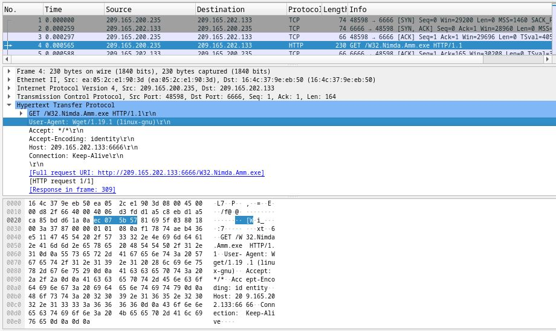 
    <em>Paso 1c.</em>

4. Los paquetes del uno al tres son la el protocolo de enlace **TCP**. En el cuarto paquete se muestra la solicitud correspondiente al archivo de malware. A modo de confirmación de lo que ya se sabía, la solicitud se realizó por HTTP, y se envió como solicitud **GET**.

5. Como HTTP se ejecuta por TCP, se puede utilizar la característica **Follow TCP Stream** (Seguir flujo de TCP) de Wireshark para reconstruir la transacción TCP. Seleccione el primer paquete TCP de la captura; es un paquete SYN. Haga clic derecho y elijan **Follow > TCP Stream**.

    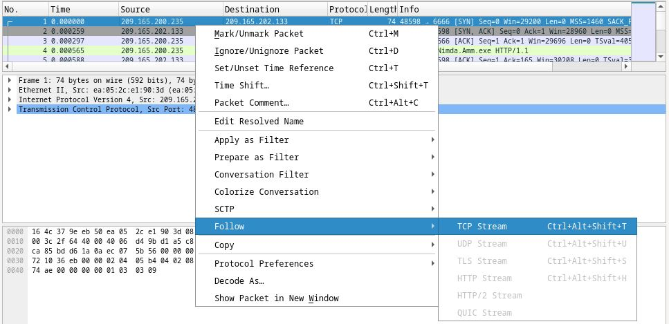 
    <em>Paso 1e.</em>

6. En Wireshark se abre otra ventana con los detalles correspondientes a todo el flujo de TCP seleccionado.

    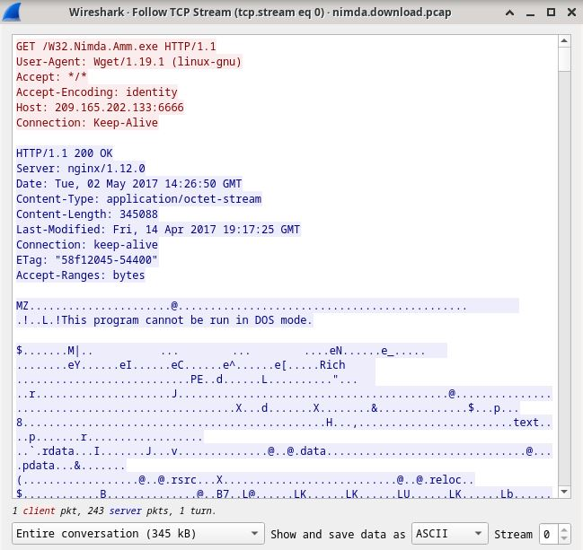 
    <em>Paso 1f.</em>

**¿Qué son todos esos símbolos que se ven en la ventana de Follow TCP Stream? ¿Son interferencias de conexión? ¿Son datos? Explique.**
    
Los símbolos representan el contenido real del archivo descargado. Al ser un archivo binario, Wireshark no puede interpretarlo directamente, por lo que muestra estos símbolos como su mejor intento de decodificar los datos binarios y presentarlos en forma de texto.

**Se pueden distinguir algunas palabras dispersas entre los símbolos. ¿Por qué están allí?**
    
Estas son cadenas que forman parte del código ejecutable. Normalmente, son mensajes que el programa muestra al usuario mientras se ejecuta. Aunque interpretar este tipo de fragmento es más arte o experiencia, un analista experimentado puede extraer información valiosa al revisarlo.

**Pregunta de desafío: Pese al nombre W32.Nimda.Amm.exe, este ejecutable no es el famoso gusano. Por motivos de seguridad, se trata de otro archivo ejecutable al que se le cambió el nombre a W32.Nimda.Amm.exe. Si utilizan los fragmentos de las palabras que se muestran en la ventana de Follow TCP Stream de Wireshark, ¿puede decir de qué ejecutable se trata en realidad?**

    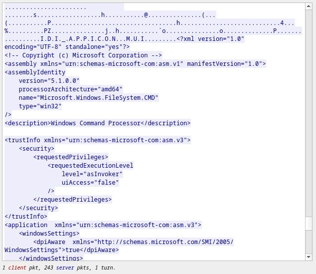 
    <em>Paso 1 desafio.</em>

En esta captura de Wireshark se puede observar elementos de un archivo de manifiesto que parece pertenecer a un ejecutable de Windows. El campo  `name="Microsoft.Windows.FileSystem.CMD"` sugiere que el archivo podría estar relacionado con el procesador de comandos de Windows (CMD), comúnmente conocido como el Símbolo del sistema o Command Prompt. La línea `<description>Windows Command Processor</description>` también refuerza la idea de que se trata de un ejecutable que corresponde al intérprete de comandos de Windows, como `cmd.exe`.
Ademas, el nivel de ejecución solicitado `level="asInvoker"` indica que el programa se ejecutará con los privilegios del usuario actual, lo cual es común para ejecutables estándar del sistema.

### Parte 2: Extraer archivos descargados desde archivos PCAP

Como los archivos de capturas contiene paquetes relacionados con el tráfico, se puede utilizar un PCAP de una descarga para recuperar un archivo descargado anteriormente. Siga los pasos que se detallan a continuación para utilizar Wireshark y recuperar el malware Nimda.

1. En ese cuarto paquete del archivo `nimda.download.pcap`, observe que la solicitud **HTTP GET** se generó desde `209.165.200.235` hacia `209.165.202.133`. En la columna Info (Información) también se ve que de hecho se trata de la solicitud **GET** correspondiente al archivo.

    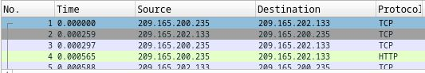 
    <em>Paso 2a.</em>

2.  Con el paquete de la solicitud **GET** seleccionado, diríjase a **File > Export Objects > HTTP** (Archivo > Exportar objetos > HTTP) desde el menú de Wireshark.

    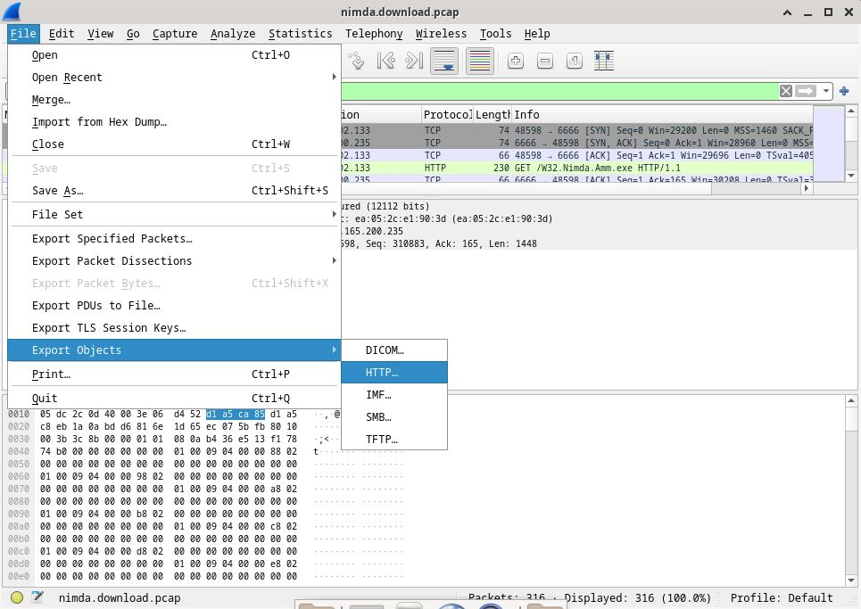 
    <em>Paso 2b.</em>

3. En Wireshark se mostrarán todos los objetos **HTTP** presentes en el flujo TCP que contiene la solicitud **GET**. En este caso, el único archivo presente en la captura es `W32.Nimda.Amm.exe.` El archivo aparecerá en pantalla después de algunos segundos.

    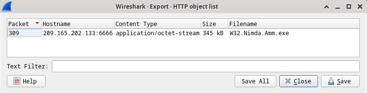 
    <em>Paso 2c.</em>

**¿Por qué W32.Nimda.Amm.exe es el único archivo presente en la captura?**

Porque la captura comenzo antes de la descarga y termino despues de la misma. Entonces, no se capturo ningun otro trafico adicional.

4. En la ventana HTTP object list (Lista de objetos HTTP), seleccione el archivo W32.Nimda.Amm.exe y haga clic en Save As (Guardar como), en la parte inferior de la pantalla.

5. En la ventana HTTP object list (Lista de objetos HTTP), seleccione el archivo W32.Nimda.Amm.exe y haga clic en Save As (Guardar como), en la parte inferior de la pantalla.

6. Regrese a su ventana del terminal y asegúrese de que el archivo se haya guardado. Cambie de directorio para ingresar a la carpeta `/home/analyst` y genere una lista de los archivos de la carpeta con el comando `ls -l`.

    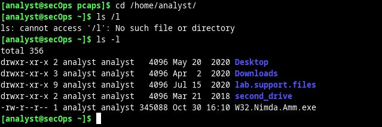 
    <em>Paso 2f.</em>

Si, se ve que se guardo el archivo.

7. El comando file proporciona información sobre el tipo de archivo. Utilice el comando file para averiguar un poco más sobre el malware, tal como se indica.

    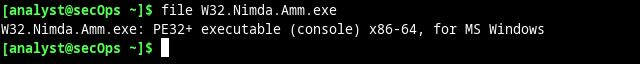 
    <em>Paso 2g.</em>

**En el proceso del análisis de malware, ¿cuál sería un próximo paso probable para un analista especializado en seguridad?**

En el proceso de análisis de malware, el siguiente paso probable para un analista de seguridad sería profundizar en la identificación del tipo de malware y en el análisis de su comportamiento. El archivo malicioso debe moverse a un entorno controlado y seguro, como una sandbox o máquina virtual aislada, para evitar cualquier impacto en sistemas de producción. Este entorno de análisis, configurado específicamente para estudiar malware, permite ejecutar el archivo y observar su comportamiento en detalle.

Durante la ejecución, el analista monitoreará aspectos clave, como:
- Uso de recursos (Carga de CPU y memoria, creación de procesos y subprocesos),
- Conexiones de red (Intentos de conexión con servidores remotos, puertos y direcciones IP, etc),
- Cambios en el sistema operativo (Modificaciones en archivos, entradas de registro, permisos).

Para un análisis más profundo, el analista puede combinar este análisis dinámico con un análisis estático, descompilando el archivo con herramientas como IDA Pro o Ghidra para inspeccionar su estructura, funciones, y código sin ejecutarlo. También puede revisar las cadenas de texto del archivo, usando el comando strings u otras herramientas, para buscar mensajes, rutas o comandos que den más pistas sobre la funcionalidad y los objetivos del malware.