# Criptografia y Seguridad en Redes

## Trabajo Practico 0A - Control de acceso en SSH
## Trabajo Practico 0B - Doble Factor de Autenticacion

### Integrantes:
- Gil Cernich, Manuel
- Mayorga, Federica

---
## Objetivo
En esta práctica de laboratorio se familiarizará con el protocolo ssh y el uso de claves públicas 
y privadas para el control de acceso. Opcionalmente podrán ampliar la práctica con libpam y con fail2ban.

## Control de acceso en SSH

### Generación de una nueva clave para SSH y adición al agente SSH
1. Abra Terminal.
   
2. Pega el texto siguiente, reemplazando el correo electrónico usado en el ejemplo por tu dirección de correo electrónico de GitHub.

```
ssh-keygen -t ed25519 -C "your_email@example.com"
```

Esto crea una llave SSH utilizando el correo electrónico proporcionado como
etiqueta.

3. Ten en cuenta que si ya creaste claves SSH anteriormente, ssh-keygen puede pedirte que vuelvas a escribir otra clave. En este caso, se recomienda crear una clave SSH con nombre personalizado. Para ello, escribe la ubicación de archivo predeterminada y reemplaza id_ssh_keyname por el nombre de clave personalizado.

4. Cuando se le pida, escriba una frase de contraseña segura.

5. Verifique que la clave se creó haciendo cat al archivo de la clave publica.
   
<p align="center">
    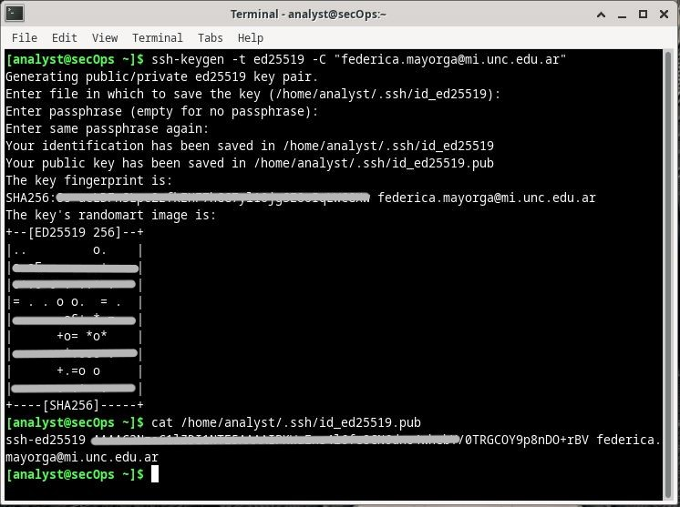<br>
    <em>Fig 1. Generacion de clave SSH</em>
</p>

¿Cuáles son los algoritmos que puede utilizar SSH? ¿RSA sigue vigente?
    - Los algoritmos criptográficos asimétricos más comunes en SSH son RSA (Rivest-Shamir-Adleman), DSA (Digital Signature Algorithm), ECDSA (Elliptic Curve Digital Signature Algorithm) y EdDSA (Edwards-curve Digital Signature Algorithm).
    - RSA sigue vigente, pero se recomienda considerar alternativas más modernas como ECDSA o EdDSA.

### Subir la clave pública ssh al servidor de entrada y al segundo servidor
Usando como servidor WSL 2 con Debian. 

1. Encienda la máquina virtual “debian server”
   
2. En la terminal ingrese con el usuario y password
   
3. Verifique la ip del servidor con el comando ip address

<p align="center">
    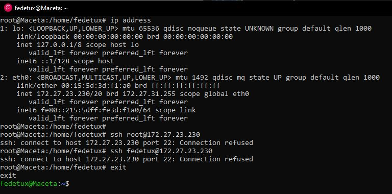<br>
    <em>Fig 2. Cmd ip address</em>
</p>

4. Intente entrar con ssh al servidor y vuelva a salir

El primer problema en la VM de CyberOps fue que no se podia levantar el ssh.service. Luego de una investigacion y consultas, se llego a que no se llamaba ssh.service sino que era un sshd.service, siendo el mismo un Daemon en lugar de un acceso.

<p align="center">
    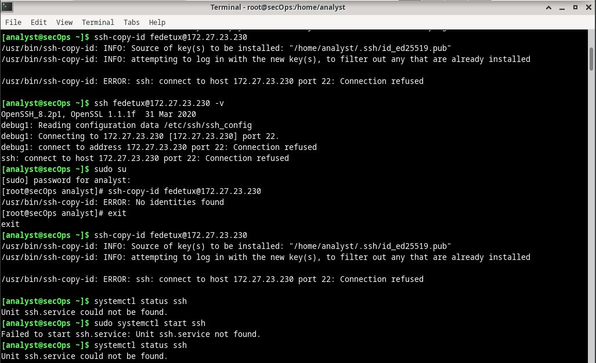<br>
    <em>Fig 3. Ssh could not be found</em>
</p>

<p align="center">
    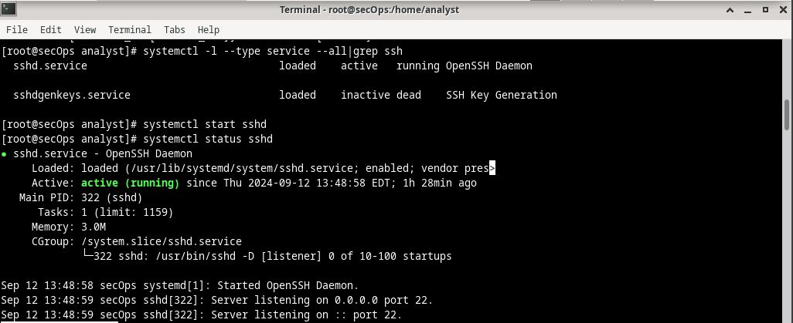<br>
    <em>Fig 4. Status del sshd en VM</em>
</p>

El segundo problema fue que en WSL 2 de Debian, el ssh.service no estaba incluido dentro del systemd, que es un conjunto de componentes básicos para un sistema Linux y proporciona un administrador de sistemas y servicios que se ejecuta como PID 1 e inicia el resto del sistema.

Para lo cual se tuvo que crear un archivo de configuracion, wsl.conf para que el sistemd lo levante. Ya despues, el ssh estaba disponible y se pudo iniciar y verificar su estado.

<p align="center">
    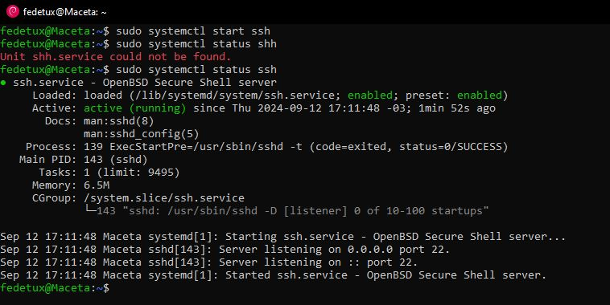<br>
    <em>Fig 5. Status del ssh en WSL</em>
</p>

6. Copiar la clave pública

Se copia la clave desde la VM como host. hacia el servidor de Debian, que es el WSL.

<p align="center">
    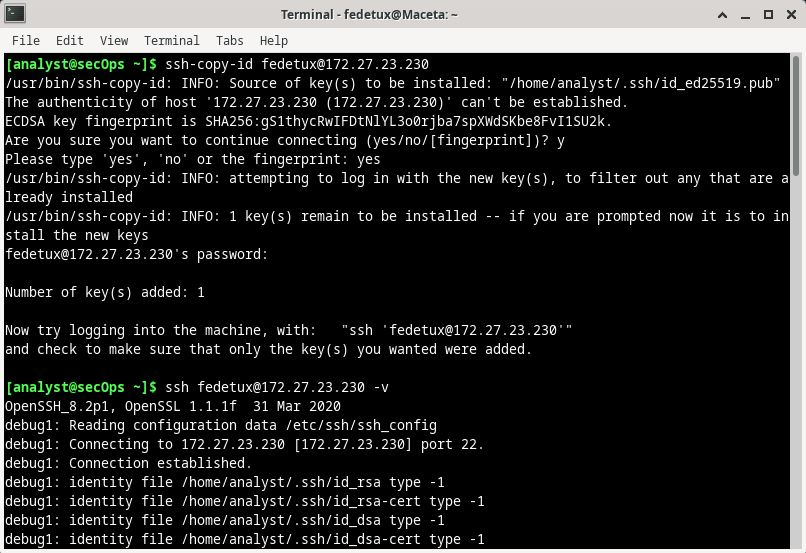<br>
    <em>Fig 6. Copia de ssh en el servidor</em>
</p>

Y se verifica el estado de ssh en el servidor, y vemos efectivamente que si se realizo la copia desde la VM hacia el serviro.

<p align="center">
    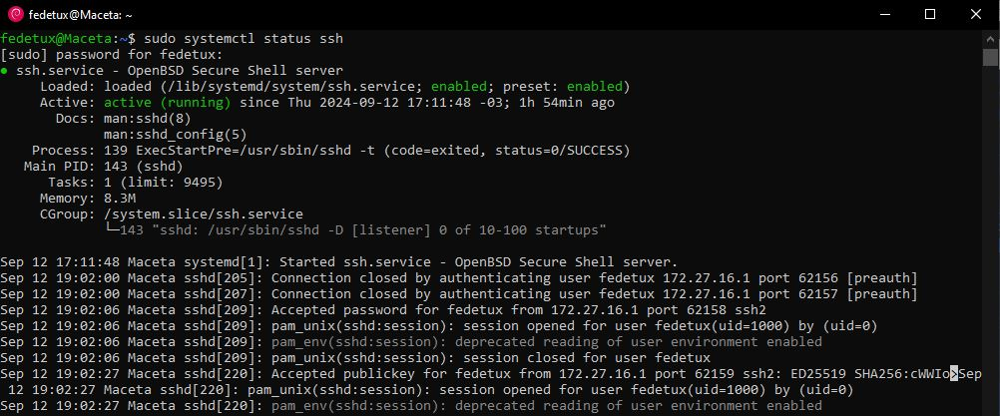<br>
    <em>Fig 7. Status del ssh en WSL copiado</em>
</p>

7. Impedir el ingreso con contraseña (opcional)

8. Reiniciar el servicio ssh

Luego, guardamos los cambios y recargamos SSH para que se efectúen

<p align="center">
    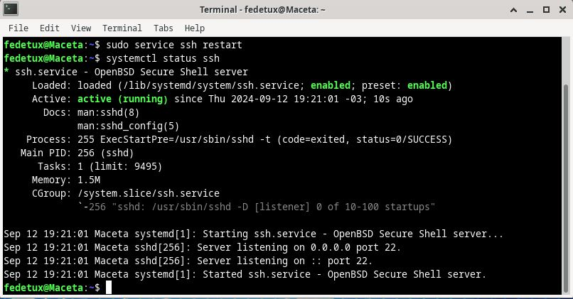<br>
    <em>Fig 8. Se reinicia el ssh en la VM</em>
</p>

9. Cree un nuevo usuario

Se crea un nuevo usuario en el servidor y se cambia al mismo.

<p align="center">
    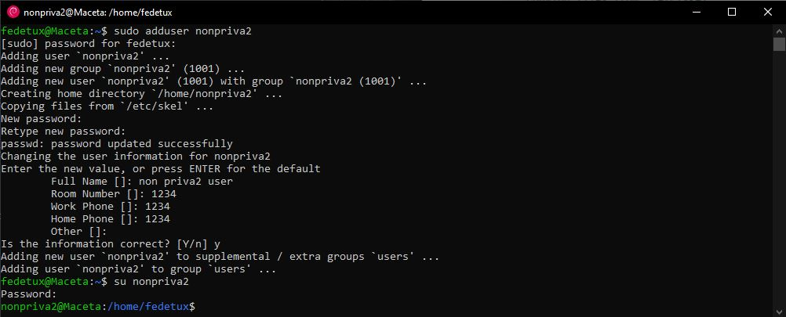<br>
    <em>Fig 9. Crea y agrega un usr</em>
</p>

Y desde la VM intento acceder por ssh con el nuevo usuario.

<p align="center">
    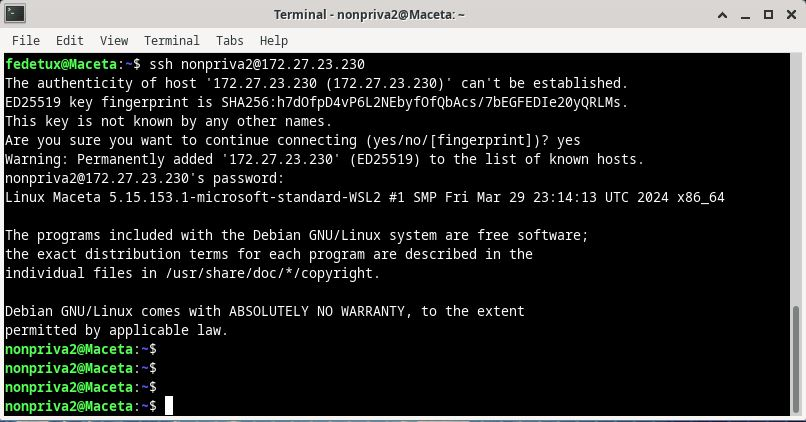<br>
    <em>Fig 10. Acceder por ssh</em>
</p>

Vemos un Warning: Permanently added ‘172.27.23.230’ (ED25519) to the list of known hosts”, que esto indica que la clave del host se ha agregado permanentemente a la lista de hosts conocidos en la máquina local.
Finalmente, el nuevo usuario ha iniciado sesión en el servidor remoto como nonpriva2.

## Banner
Como no todo tiene que ser monotono, mostramos nuestro banner de inicio de sesion.

<p align="center">
    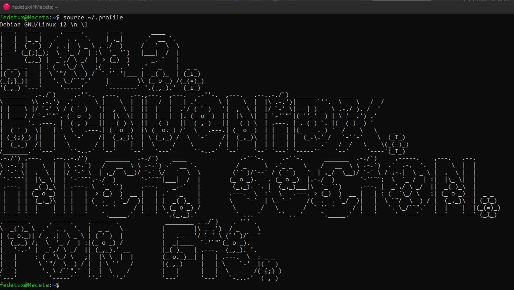<br>
    <em>Fig 11. Acceder por ssh</em>
</p>


---

## Doble Factor de Autenticacion

### Paso 1: instalar PAM de Google
PAM es Pluggable Authentication Modules, es una infraestructura de
autenticación utilizada en sistemas Linux para autenticar a un usuario.

<p align="center">
    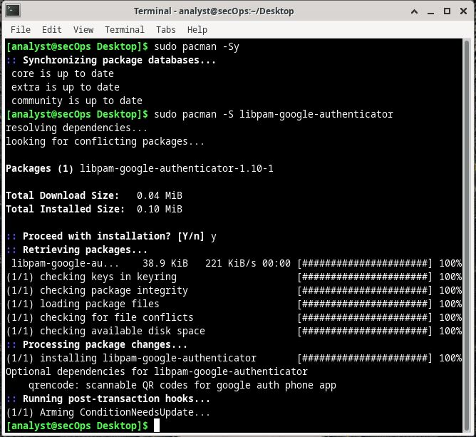<br>
    <em>Fig 1. Generacion de clave SSH</em>
</p>

Con el PAM instalado, usaremos una aplicación auxiliar que viene con el PAM para generar una clave TOTP para el usuario que necesita un segundo factor.

<p align="center">
    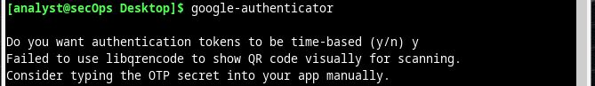<br>
    <em>Fig 1. Generacion de clave SSH</em>
</p>

Una vez finalizadas las preguntas de configuracion de google authenticator, hacemos el siguiente paso.

### Paso 2: Configurar OpenSSH para usar MFA/2FA
A partir de ahora, no puedo usar el cmd sudo.