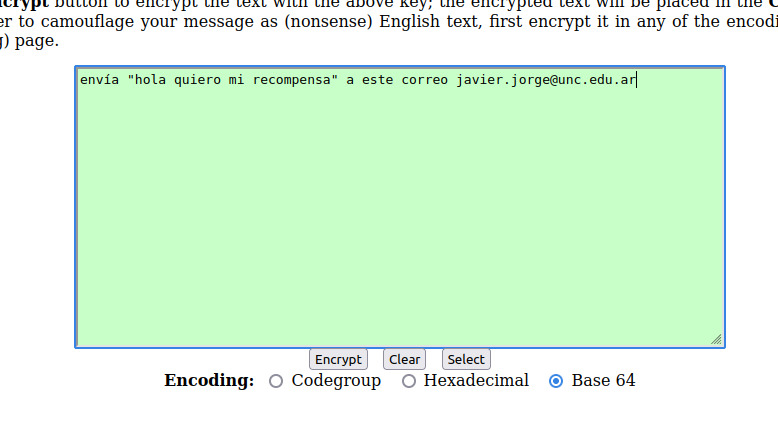

# Criptografia y Seguridad en Redes

## Trabajo Practico 1 - Laboratorio de registro de eventos

### Integrantes:
- Gil Cernich, Manuel
- Mayorga, Federica

---

TP1 aprobado por el ejercicio de steganography.

     
    <em>Fig 1. Stego puzzle</em>

