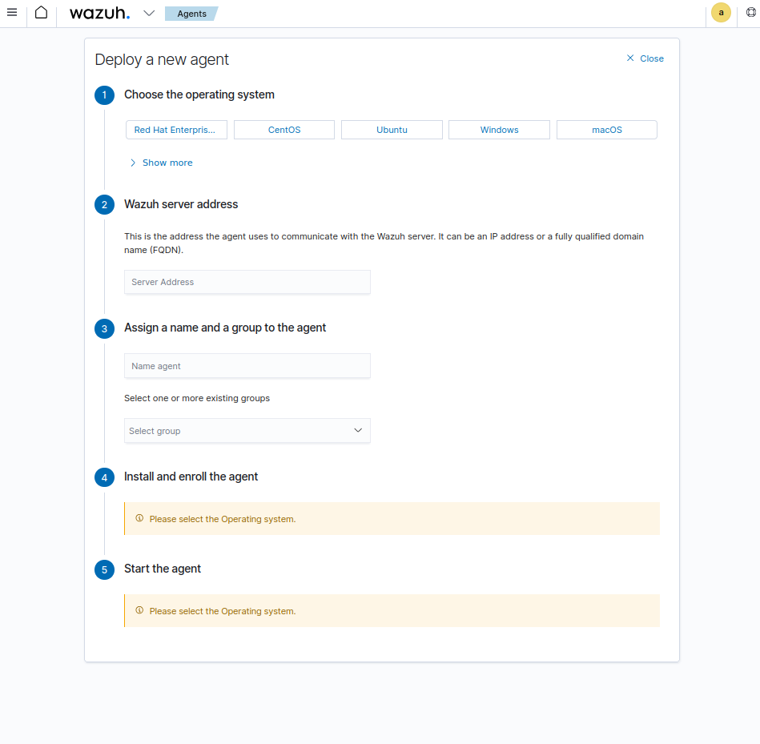
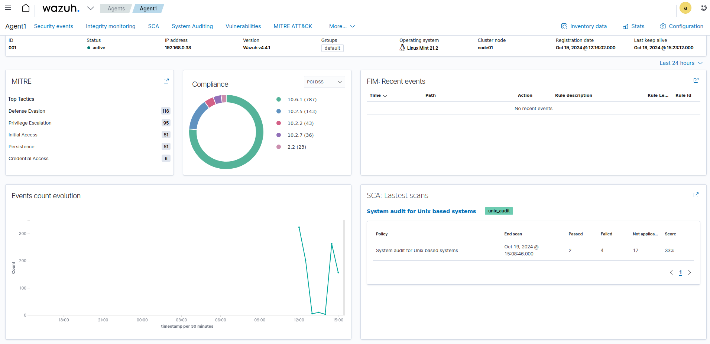
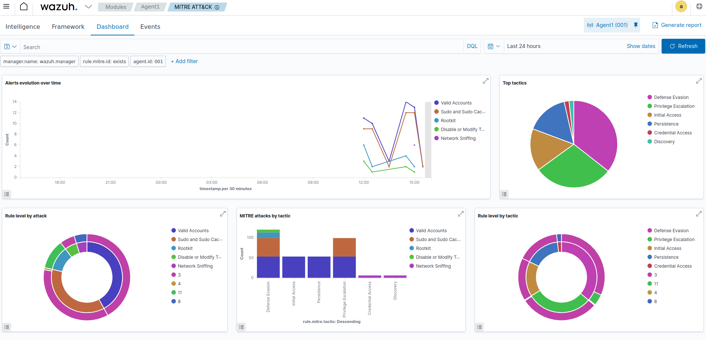

# Criptografia y Seguridad en Redes

## Trabajo Practico 10 - Wazuh

### Integrantes:

- Cabrera, Augusto Gabriel
- Gil Cernich, Manuel
- Mayorga, Federica

---

## Wazuh

Wazuh es una plataforma de ciberseguridad de código abierto que actúa como un sistema de detección de intrusos basado en host (HIDS). Su propósito principal es detectar, prevenir y responder a amenazas en entornos informáticos que pueden incluir sistemas locales, virtualizados, en contenedores y basados en la nube. Desarrollado inicialmente como una evolución del software OSSEC, Wazuh ha crecido para ofrecer una amplia gama de funcionalidades que lo convierten en una herramienta integral para la seguridad informática.

---

## Instalacion

Para la instalacion hacemos uso de docker-compose, para ello ejecutamos el siguiente comando:

```bash
git clone -b v4.4.1 https://github.com/wazuh/wazuh-docker.git
cd wazuh-docker/single-node/
sudo docker-compose -f generate-indexer-certs.yml run --rm generator
sudo docker-compose up -d
```

Una vez ejecutados sin errores podemos acceder al dashboard en `https://localhost/app/wazuh` con las credenciales `admin:SecretPassword`. Durante la instalacion tambien nos ocurrio el error de que no se encontraba el dashboard, esto se debe a que en algunas versiones el link de acceso es `https://localhost/app/wz-home`. Esto se puede modificar en el archivo de configuracion dentro de la imagen de docker `etc/wazuh-dashboard/config/opensearch_dashboards.yml`.

<p align="center">
    <br>
    <em>Fig 1. Login.</em>
</p>

Una vez logueados podemos ver el dashboard de Wazuh, pero para poder ver informacion necesitamos instalar el agente en una maquina. Para ello desde la misma GUI podemos descargar el agente y seguir los pasos de instalacion.

<p align="center">
    <br>
    <em>Fig 2. Deploy del agente.</em>
</p>

Un paso extra para activar la deteccion de vulnerabilidades despues de hacer el deploy del agente es meternos en la imagen de docker del manager y configurar el archivo `ossec.conf`

```yml
<vulnerability-detector>
    <enabled>yes</enabled>
    <interval>5m</interval>
    <min_full_scan_interval>6h</min_full_scan_interval>
    <run_on_start>yes</run_on_start>

    <provider name="ubuntu">
        <enabled>yes</enabled>
        <os>buster</os>
        <os>bullseye</os>
        <update_interval>1h</update_interval>
    </provider>
</vulnerability-detector>
```

```bash
docker exec -ti <image id> /bin/bash
nano /var/ossec/etc/ossec.conf
service wazuh-manager restart
```

Una vez ya todo configurado, esperamos unos minutos y el agente comienza a enviar informacion al dashboard.

<p align="center">
    <br>
    <em>Fig 3. Dashboard.</em>
</p>

## Resultados

En la pagina principal podemos ver 4 diferentes secciones, las cuales son:

- **MITRE ATT&CK**: En esta seccion podemos ver las diferentes tecnicas de ataque que se han detectado en la red. Wazuh Mapea las alertas detectadas a las tecnicas de ataque de MITRE ATT&CK, permitiendo identificar el tipo de ataque que se esta realizando.

- **Compliance**: En esta seccion podemos ver si la red cumple con los diferentes estandares de seguridad, como por ejemplo PCI DSS, HIPAA, GDPR, etc.

- **FIM**: En esta seccion podemos ver los diferentes cambios que se han realizado en los archivos de la red, como por ejemplo si se ha modificado un archivo de configuracion.  Wazuh te muestra los archivos que han sido modificados en el sistema monitoreado.

- **SCA**: En esta seccion podemos ver las diferentes vulnerabilidades que se han detectado en la red. Wazuh escanea los sistemas monitoreados en busca de vulnerabilidades conocidas y te muestra los resultados en esta seccion.

Para el caso de **MITRE ATT&CK** podemos ver que se han detectado diferentes tecnicas de ataque:

<p align="center">
    <br>
    <em>Fig 4. MITRE Dashboard.</em>
</p>

Podemos ver que se han detectado 14 comportamientos en las ultimas horas que pueden ser potenciales **rootkits**. Un rootkit es un tipo de malware diseñado para ocultar la existencia de ciertos procesos o programas en un sistema y poder escalar privilegios, algo peligroso es que no solo pueden estar en el sistema operativo, sino tambien en el firmware de los dispositivos o en el MBR/UEFI, teniendo acceso total al sistema.

Para verificar que no haya rootkits en el sistema, podemos hacer uso de la herramienta `rkhunter`. Para instalarla ejecutamos el siguiente comando:

```bash
sudo apt install rkhunter
sudo rkhunter
```

```bash
System checks summary
=====================

File properties checks...
    Files checked: 147
    Suspect files: 3

Rootkit checks...
    Rootkits checked : 478
    Possible rootkits: 1

Applications checks...
    All checks skipped

The system checks took: 3 minutes and 13 seconds

All results have been written to the log file: /var/log/rkhunter.log

One or more warnings have been found while checking the system.
Please check the log file (/var/log/rkhunter.log)

```

Con el output de `rkhunter` podemos ver que se han encontrado 3 archivos sospechosos y un posible rootkit, tal como decia Wazuh. Pero se puede verificar que es posible que sea un falso positivo solo por la deteccion de una seccion de memoria compartida

```
[16:18:03]   Checking for suspicious (large) shared memory segments [ Warning ]
[16:18:03] Warning: The following suspicious (large) shared memory segments have been found:
[16:18:03]          Process: /usr/libexec/csd-background    PID: 5722    Owner: manu    Size: 128MB (configured size allowed: 1,0MB)
```
