# Criptografia y Seguridad en Redes

## Trabajo Practico 12 - Aislar hosts afectados con el método de cinco tuplas

### Integrantes:

- Cabrera, Augusto Gabriel
- Gil Cernich, Manuel
- Mayorga, Federica

---

## Objetivo
En esta práctica de laboratorio revisará archivos de registro durante el ataque a una vulnerabilidad documentada para determinar los hosts y el archivo comprometidos.

Los administradores de TI utilizan el método de 5 tuplas cuando necesitan identificar los requisitos necesarios para crear un entorno de red operativo y seguro. Los componentes de 5-Tuple son los siguientes: la dirección IP y el número de puerto de origen, la dirección IP y el número de puerto de destino y el protocolo en uso. Este es el campo de protocolo del encabezado del paquete IP.

### Parte 1: Revisar alertas en Sguil

1. Inicie sesión en la máquina virtual Security Onion con el nombre de usuario analyst y contraseña cyberops.

2. Abra Sguil e inicie sesión. Haga clic en Select All (Seleccionar todo) y, luego, en Start SGUIL. (Iniciar SGUIL).

    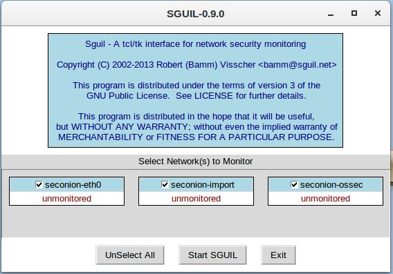 
    <em>Paso 1b.</em>

3. Revise los eventos que aparecen en la lista de la columna Event Message (Mensaje de eventos). Uno de los mensajes son **GPL ATTACK_RESPONSE id check returned root**. Este mensaje indica que es posible que se haya obtenido acceso raíz durante un ataque. El host de `209.165.200.235` devolvió el acceso raíz a `209.165.201.17`. En este ejemplo se utiliza el ID de alerta 5.1.

    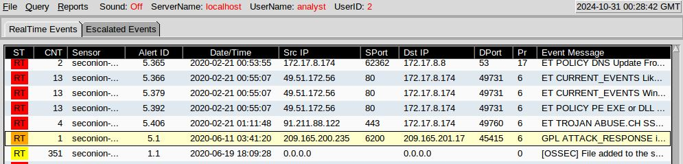 
    <em>Paso 1c.</em>

4. Seleccione las casillas de verificación **Show Packet Data** (Mostrar datos del paquete) y **Show Rule** (Mostrar regla) para ver cada alerta más detalladamente.

    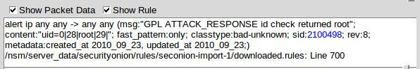 
    <em>Paso 1d.</em>

5. Haga clic derecho sobre el ID 5.1 de la alerta y seleccione **Transcript**.

    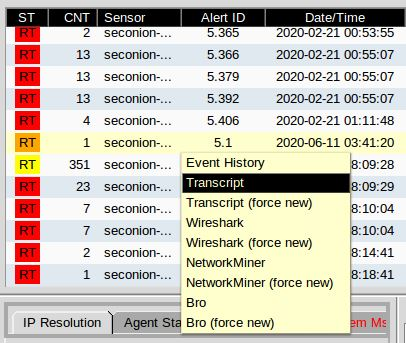 
    <em>Paso 1e.</em>

6. Revise las transcripciones correspondientes a todas las alertas. La transcripción muestra las transacciones entre el origen del agente de amenaza (SRC) y el objetivo (DST) durante el ataque. El actor de amenazas está ejecutando comandos Linux en el destino.

    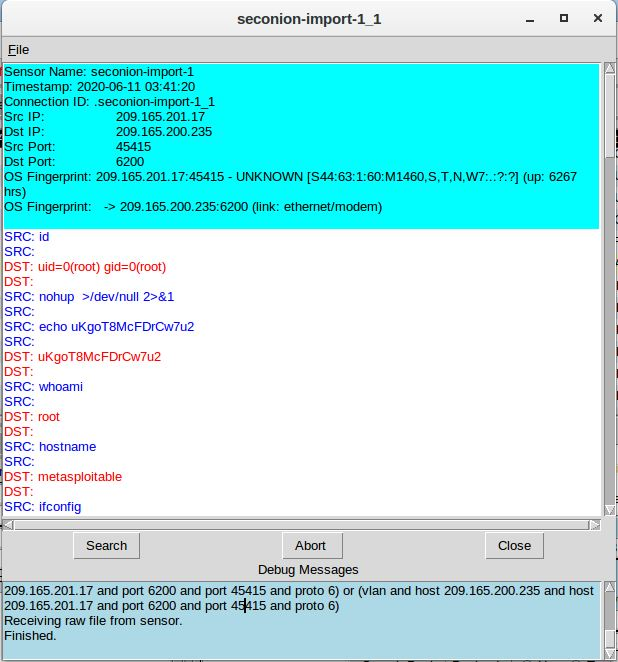 
    <em>Paso 1f.</em>

**¿Qué tipo de transacciones ocurrieron entre el cliente y el servidor en este ataque?**

El atacante de la direccion 209.165.201.17, obtuvo acceso de root a la direccion 209.165.200.235. Y es asi como al navegar por el sistema de archivos, logra copiar el archivo shadow y editar /etc/shadow y /etc/passwd.

### Parte 2: Pasar a Wireshark

1. Seleccione la alarma que les proporcionó la transcripción en el paso anterior. Haga clic derecho sobre el ID 5.1 de la alerta y seleccione **Wireshark**. En la ventana principal de Wireshark se muestran 3 vistas de un paquete.

    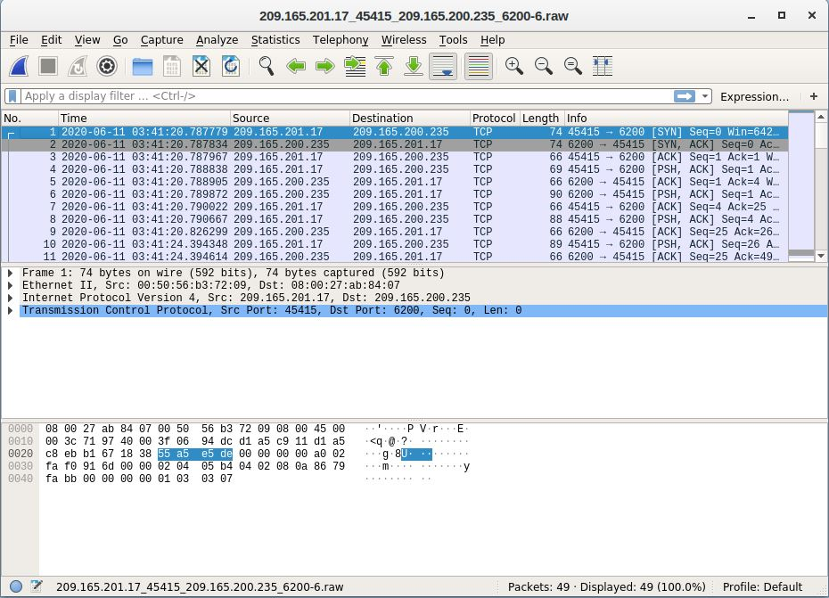 
    <em>Paso 2a.</em>

2. Para ver todos los paquetes ensamblados en una conversación de TCP, haga clic derecho sobre cualquier paquete y seleccione **Follow > TCP Stream** (Seguir flujo de TCP).

    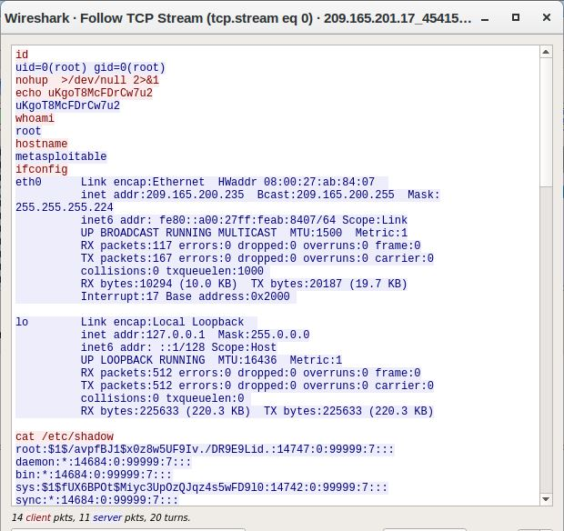 
    <em>Paso 2b.</em>

**¿Qué observó? ¿Qué indican los colores de texto rojo y azul?**

El flujo TCP representa la comunicación entre un atacante (texto rojo), los comandos que inicia y el objetivo (texto azul). La información del flujo TCP coincide con la transcripción. El nombre de host del objetivo es “metasploitable” y su dirección IP es 209.165.200.235.

**El atacante emite el comando `whoami` en el objetivo. ¿Qué muestra esto sobre el rol de atacante en el equipo de destino?**

Que el atacante tiene todos los privilegios de raíz (root) en la computadora de destino del objetivo.

**Desplácese por el flujo TCP. ¿Qué tipo de datos ha estado leyendo el agente de amenaza?**

Ha estado leyendo informacion sobre la cuenta del usuario.

3. Salga de la ventana del flujo de TCP. Cierre Wireshark cuando hayan terminado de revisar la información provista por Wireshark.

### Parte 3: Pivotar a Kibana

1. Regrese a Sguil. Haga clic con el botón derecho en la IP de origen o destino para el ID de alerta 5.1 y seleccione Búsqueda IP de **Kibana > SRCIp**. Introduzca analyst como nombre de usuario y cyberops como contraseña cuando ELSA se los solicite.

    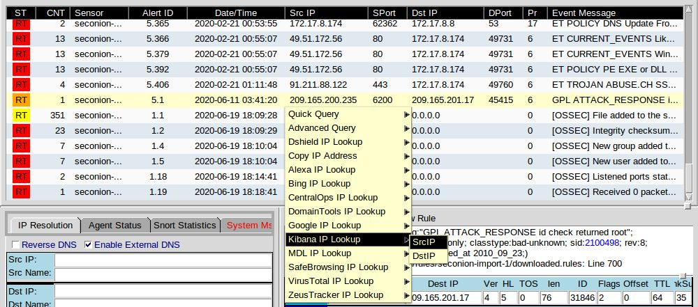 
    <em>Paso 3a.</em>

2. Si el intervalo de tiempo es de las últimas 24 horas, cámbielo a junio de 2020 para que el 11 de junio esté incluido en el intervalo de tiempo. Utilice la ficha Absoluto para cambiar el intervalo de tiempo.

3. En los resultados mostrados, hay una lista de diferentes tipos de datos. Le dijeron que el archivo confidential.txt ya no es accesible. En los sensores - sensores y servicios (gráfico circular), ftp y ftp-data están presentes en la lista, como se muestra en la figura. Determinará si se utilizó FTP para robar el archivo.

    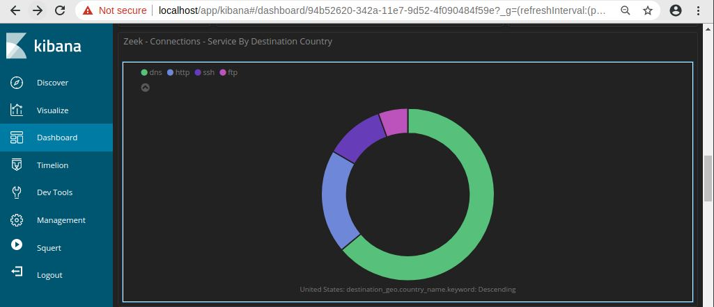 
    <em>Paso 3c.</em>

4. Vamos a filtrar para **bro_ftp**. Pase el cursor sobre el espacio vacío junto al recuento de tipos de datos bro_ftp. Seleccione + para filtrar sólo el tráfico relacionado con FTP como se muestra en la figura.

    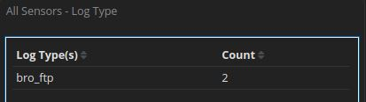 
    <em>Paso 3b.</em>

5. Desplácese hasta la sección **All Logs**. Existen dos entradas enumeradas.

**¿Cuáles son las direcciones IP y los números de puerto de origen y de destino para el tráfico FTP?**

    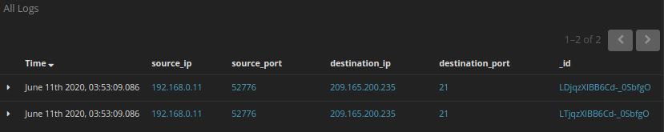 
    <em>Paso 3e.</em>

La direccion IP de origen es 192.168.0.11 y el puerto 52776, y la direccion IP de destino es 209.165.200.235 con el puerto 21.

6. Expanda y revise ambas entradas de registro. En una de estas entradas, el argumento ftp_tiene una entrada de ftp://209.165.200.235/./confidencial.txt. Revise también el mensaje en la entrada de registro para obtener más información sobre este evento.

    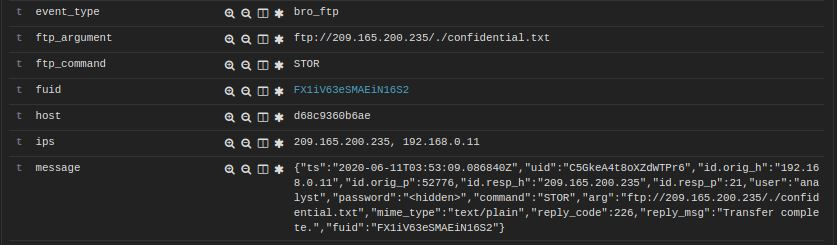 
    <em>Paso 3f.</em>

7. Dentro de la misma entrada de registro, desplácese hacia arriba hasta el campo alert _id y haga clic en el vínculo.

    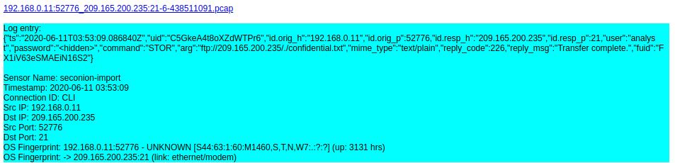 
    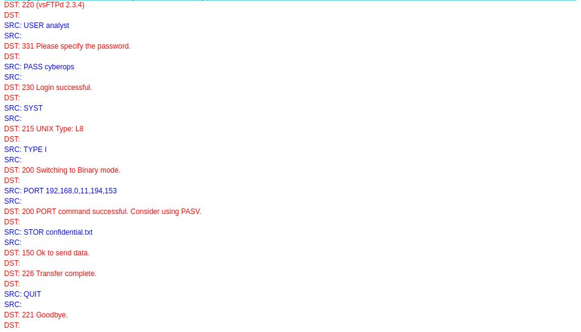 

8. Revise la transcripción de las transacciones entre el atacante y el destino. Si lo desea, puede descargar el pcap y revisar el tráfico usando Wireshark.

    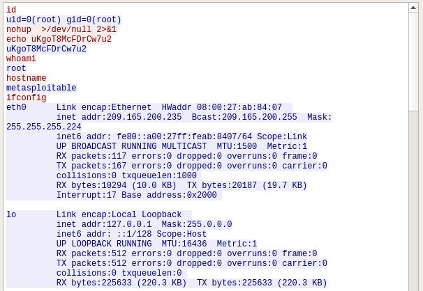 
    <em>Paso 3h.</em>

**¿Cuáles son las credenciales de usuario para acceder al sitio FTP?**
Solo el nombre de usuario y la contraseña:
Username - analyst
Password - cyberops

9. Ahora que ha verificado que el atacante ha utilizado FTP para copiar el contenido del archivo `confidential.txt` y luego lo ha eliminado del destino. Entonces, ¿cuál es el contenido del archivo? Recuerde que uno de los servicios enumerados en el gráfico circular es ftp_data.

10. Navegue hasta la parte superior del panel. Seleccione Archivos bajo el encabezado Zeek Hunting en el panel izquierdo, como se muestra en la figura. Esto le permitirá revisar los tipos de archivos que se registraron.

    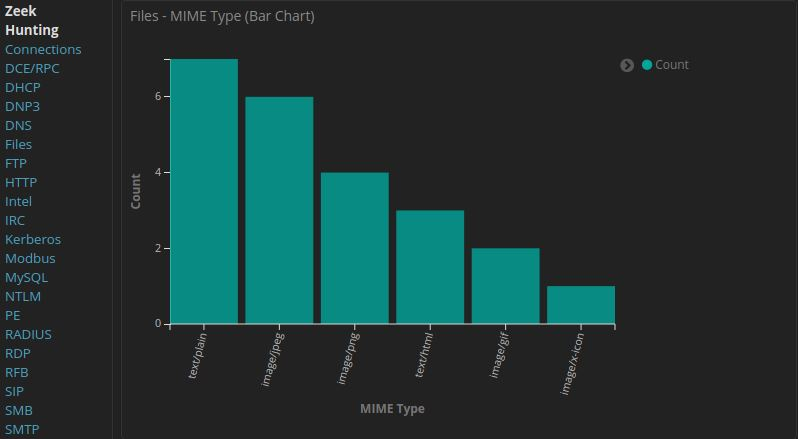 
    <em>Paso 3j.</em>

**¿Cuáles son los diferentes tipos de archivos?**

Los diferentes tipos de archivos son text/plain, image/jpeg, image/png, text/html, image/gif y image/x-icon.

**Desplácese hasta el encabezado Archivos - Origen. ¿Cuáles son los orígenes de archivos enumerados?**

    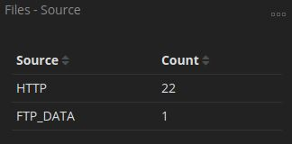 
    <em>Paso 3j.</em>

Los origenes de los archivos numerados son HTTP y FTP_DATA.

11. Para filtrar FTP_DATA, pase el cursor sobre el espacio vacío situado junto al Count for FTP_DATA y haga clic en +.

    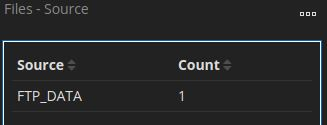 
    <em>Paso 3k.</em>

12. Desplácese hacia abajo para ver los resultados de la búsqueda.

    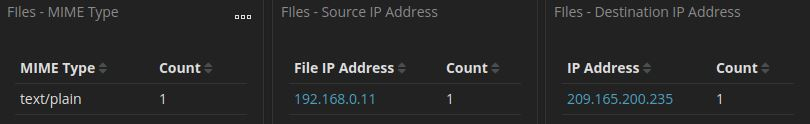 
    <em>Paso 3l.</em>

**¿Cuál es el tipo MIME, la dirección IP de origen y destino asociado con la transferencia de los datos FTP? ¿Cuándo ocurrió esta transferencia?**

El tipo MIME es text/plain, la direccion IP de origen es 192.168.0.11 y el destino asociado con la transferencia es 209.165.200.235.
Esta transferencia ocurrio el 11/06/2020 a las ~03:53hs.

    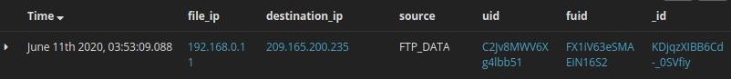 
    <em>Paso 3l.</em>

13. En los registros de archivos, expanda la entrada asociada a los datos FTP. Haga clic en el vínculo asociado con alert _id.

    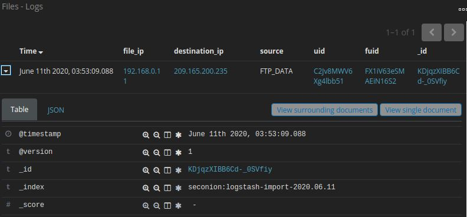 
    <em>Paso 3m.</em>

**¿Cuál es el contenido de texto del archivo que se transfirió mediante FTP?**

    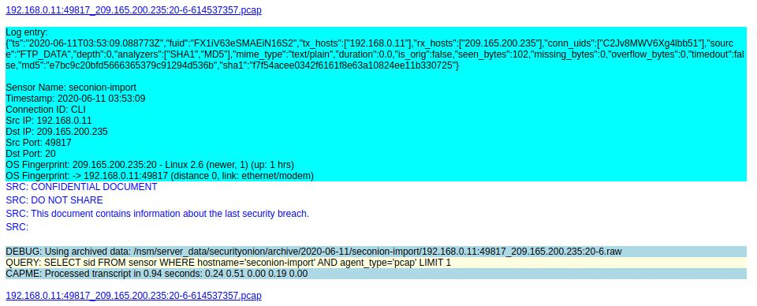 
    <em>Paso 3m.</em>

**Con toda la información recopilada hasta ahora, ¿cuál es su recomendación para detener nuevos accesos no autorizados?**

Se podria optar fuertemente por cambiar la información del usuario y la constraseña por una mas robusta.