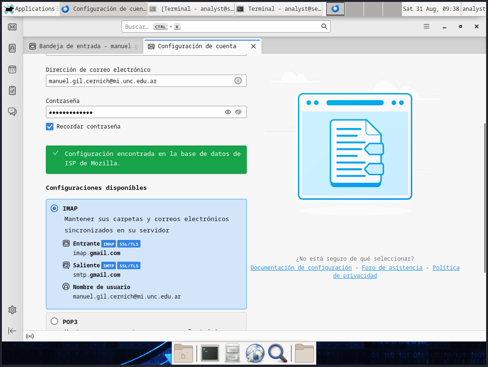
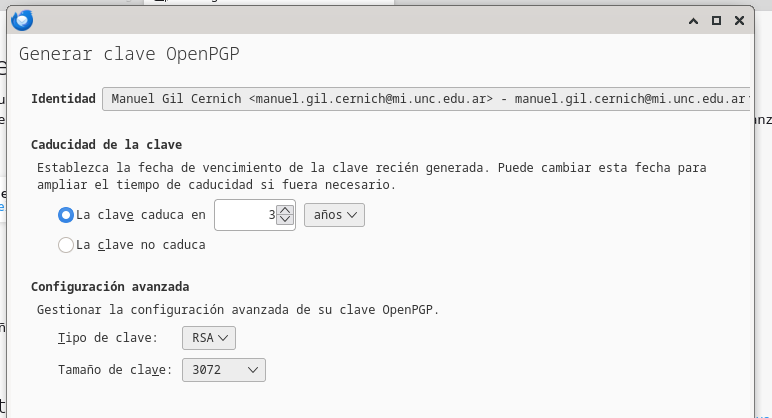
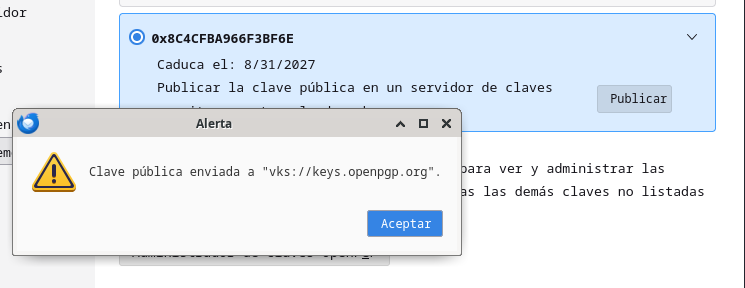
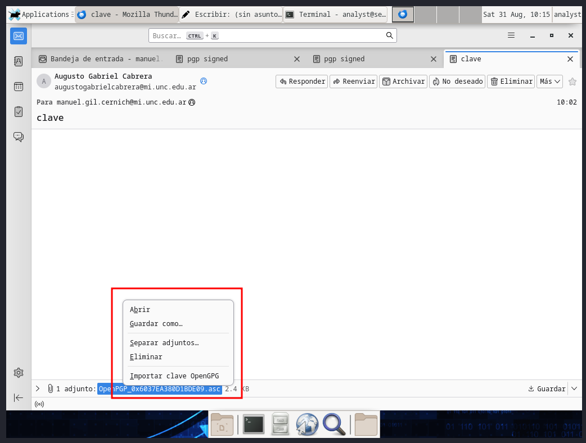
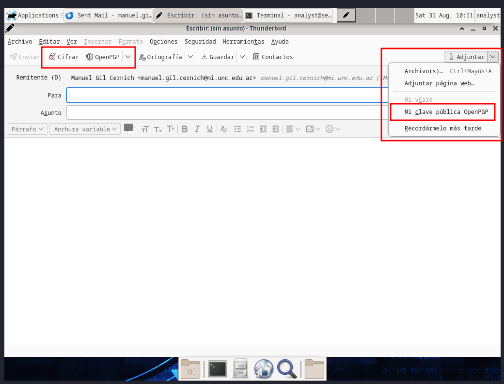
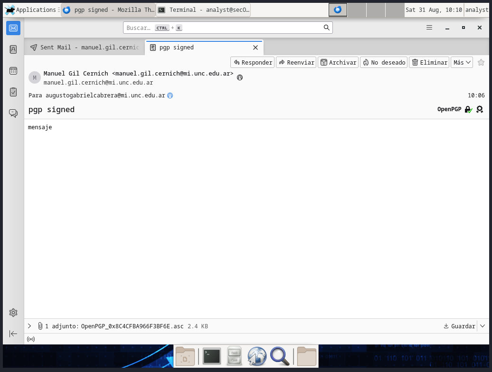
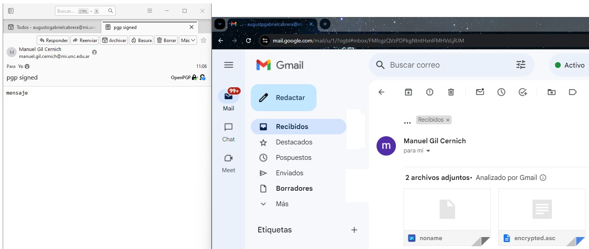

# Criptografia y Seguridad en Redes

## Trabajo Practico 3 - Firma Digital

### Integrantes:
- Gil Cernich, Manuel
- Mayorga, Federica

---
## Objetivo

En esta práctica de laboratorio veremos el funcionamiento y la configuracion de la firma digital en correos electronicos.

---

### Configuracion

Para poder utilizar la firma digital, necesitamos de un cliente de correo que soporte esta funcionalidad. En este caso, utilizaremos Thunderbird. Lo descargamos de su pagina oficial e instalamos en nuestra maquina virtual.

```bash
$ tar xjf thunderbird-*.tar.bz2
$ sudo mv thunderbird /opt/
$ sudo ln -s /opt/thunderbird/thunderbird /usr/bin/thunderbird
$ thunderbird
```

Una vez instalado necesitamos configurar nuestro correo en el cliente, ingresando nuestras credenciales, y manualmente configurando que la seguridad de conexion tanto entrando como saliente sea SSL/TLS.

<p align="center">
    <br>
    <em>Fig 1. Instalacion de thunderbird en la vm.</em>
</p>

Al iniciar sesion, thunderbird automaticamente descargara los correos de la cuenta configurada. Para poder firmar un correo, primero debemos generar nuestra clave PGP. Para ello, vamos a la configuracion de thunderbird, y en la seccion de "Configuracion de seguridad" seleccionamos "Configuracion de OpenPGP", generamos nuestra clave.

<p align="center">
    <br>
    <em>Fig 2. Generamos la clave PGP.</em>
</p>

Con la clave generada, desde la misma ventana de configuracion de seguridad, seleccionamos nuestra clave y la publicamos para que sea visible. De esta forma, ya podemos firmar correos.

<p align="center">
    <br>
    <em>Fig 3. Publicamos y seteamos la clave PGP.</em>
</p>


### Enviar un correo firmado

Para enviar un correo firmado, necesitamos tanto de nuestra clave privada como de la clave publica del destinatario. Para ello primero debemos importar la clave publica del destinatario, que la deberiamos haber recibido previamente. Para importarla una vez recibida simplemente es hacer click derecho e importar.

<p align="center">
    <br>
    <em>Fig 4. Obtenemos la PGP del remitente.</em>
</p>

Ahora para enviar nuestro correo firmado, redactamos el correo y seleccionamos la opcion de "OpenPGP" en la parte superior, ciframos el mensaje y adjuntamos nuestra key. De esta forma, el destinatario podra verificar que el correo fue enviado por nosotros.

<p align="center">
    <br>
    <em>Fig 5. Configuracion para enviar el email.</em>
</p>

Podemos ver como el correo fue enviado correctamente y la firma fue cargada correctamente.

<p align="center">
    <br>
    <em>Fig 6. Email enviado.</em>
</p>

Desde el correo del destinatario, podemos ver como el correo fue recibido correctamente y la firma fue verificada correctamente.

<p align="center">
    <br>
    <em>Fig 7. Email recibido correctamente con la clave PGP</em>
</p>