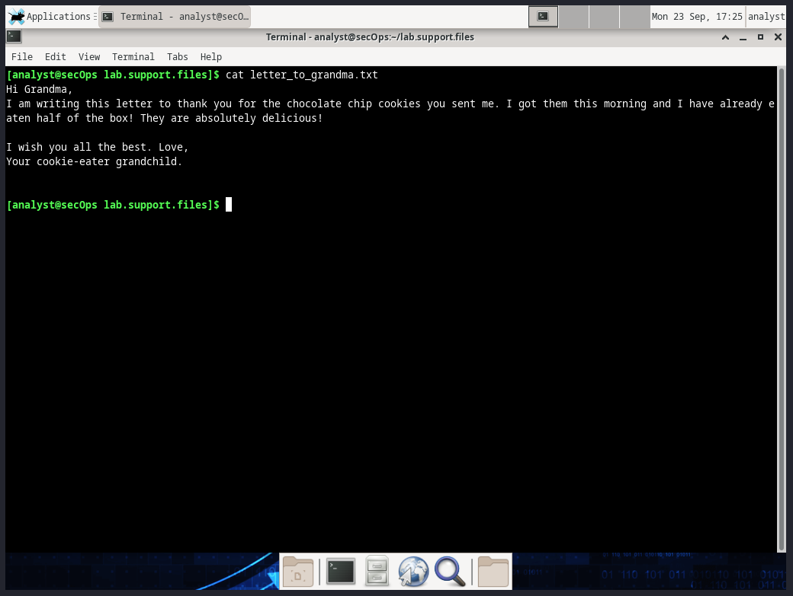
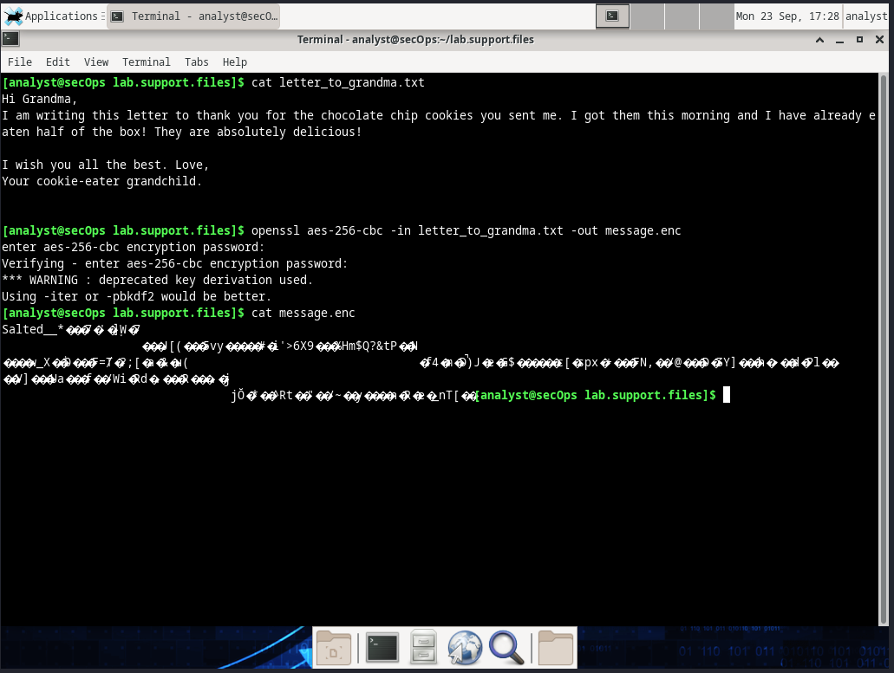
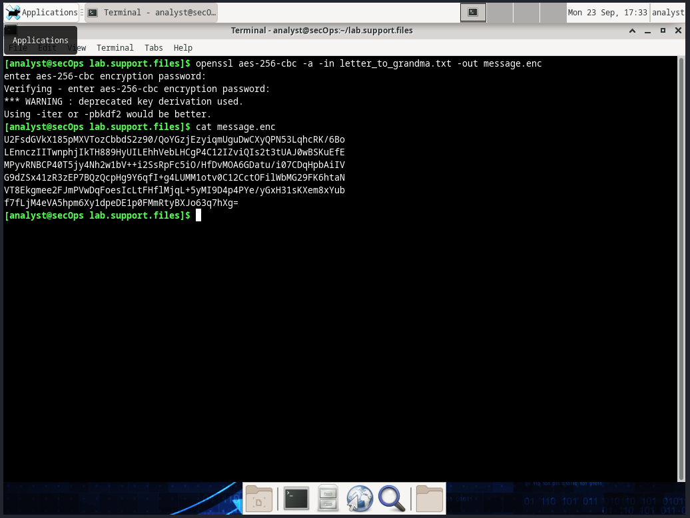
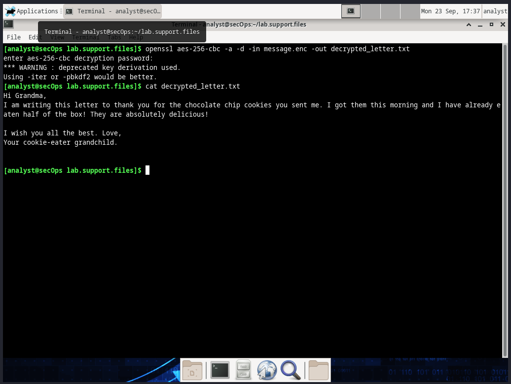
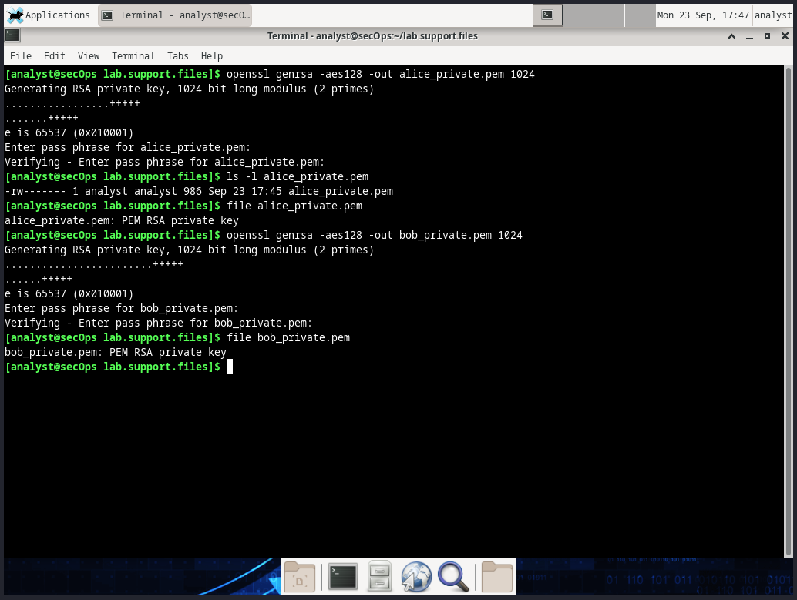
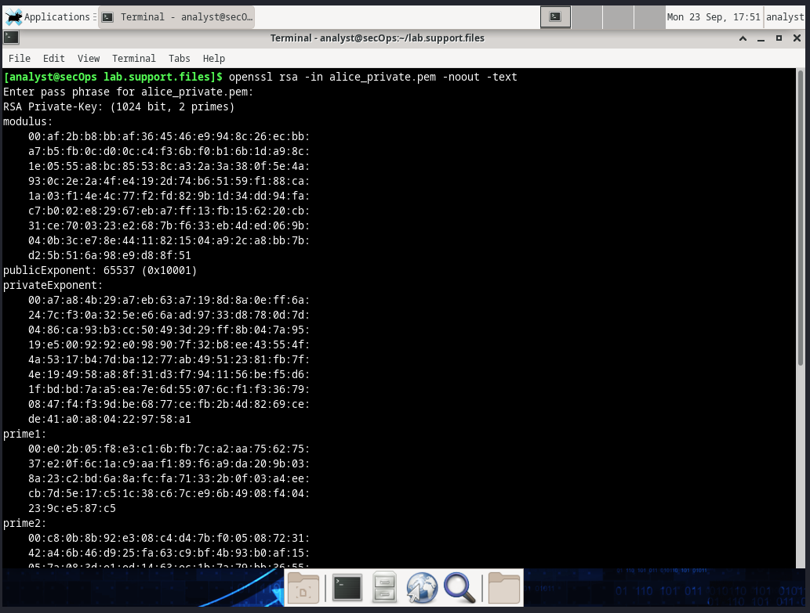
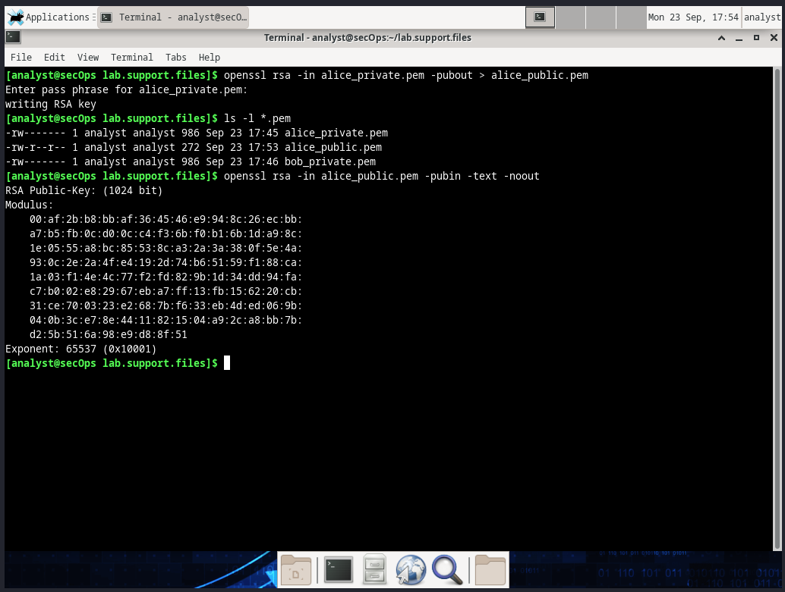
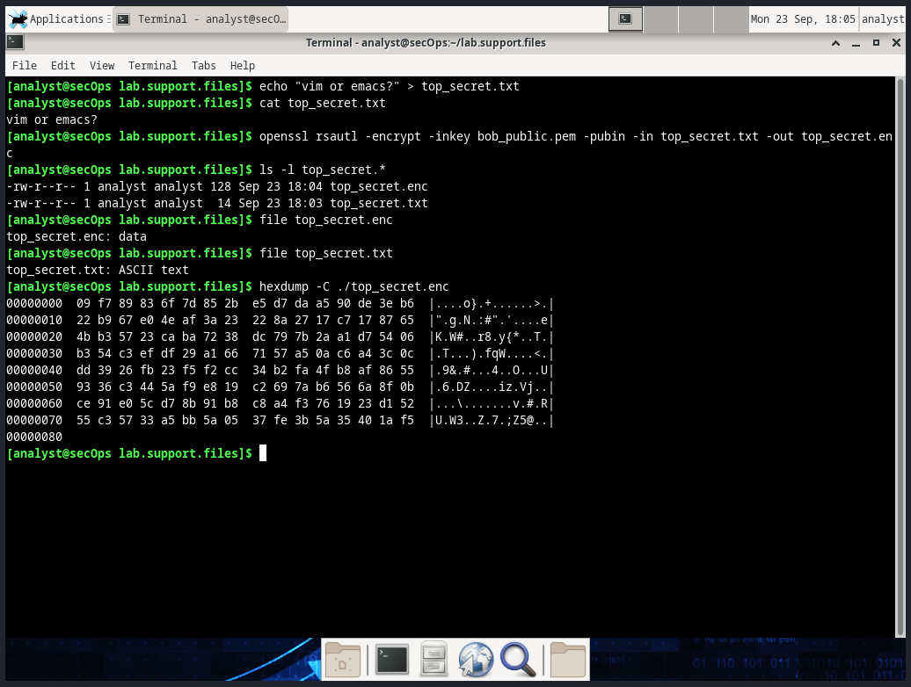
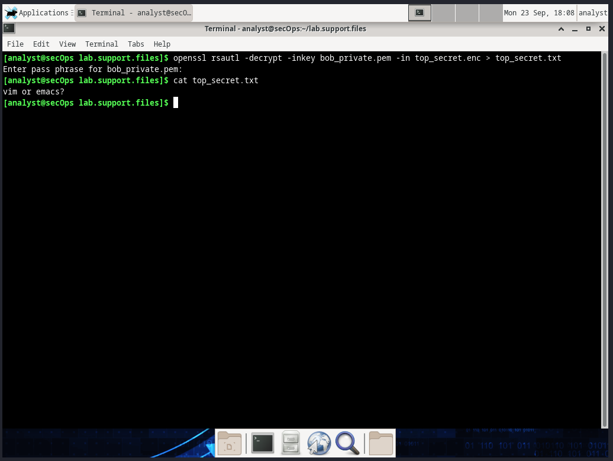

# Criptografia y Seguridad en Redes

## Trabajo Practico 5 - OpenSSL

### Integrantes:

- Gil Cernich, Manuel
- Mayorga, Federica

---

## Objetivos

El objetivo de este trabajo practico es aprender a utilizar la herramienta OpenSSL para generar certificados y claves publicas y privadas, y utilizarlas para establecer una comunicacion segura entre dos entidades.

1. Parte 1: Cifrar y descifrar mensajes con OpenSSL utilizando criptografia simetrica.
2. Parte 2: Cifrar y descifrar mensajes con OpenSSL utilizando criptografia asimetrica.

---

## OpenSSL

OpenSSL es una libreria de codigo abierto que implementa el protocolo SSL/TLS, y provee una serie de herramientas para trabajar con certificados, claves publicas y privadas, y cifrado de datos.

### Cifrado y descifrado de mensajes con clave simetrica

#### Cifrado

En nuestro entorno de trabajo vamos a utilizar la herramienta `openssl` para cifrar y descifrar mensajes utilizando una clave simetrica. Para ello, vamos a utilizar un archivo de texto como ejemplo `letter_to_grandma.txt`.

<p align="center">
    <br>
    <em>Fig 1. Mensaje a encriptar.</em>
</p>

Para cifrar este archivo vamos a utilizar AES-256 cbc, que es un algoritmo de cifrado simetrico otorgandole una contrasena de cifrado, en este caso `password123`. Para cifrar el archivo utilizamos el siguiente comando:

```bash
openssl aes-256-cbc -in letter_to_grandma.txt -out message.enc
```

<p align="center">
    <br>
    <em>Fig 2. Mensaje encriptado en archivo binario.</em>
</p>

Como podemos ver, el archivo `message.enc` es el archivo cifrado que contiene el mensaje original y no es legible, si no que tiene caracteres no imprimibles al ser un archivo binario. Si quisieramos cifrar el mensaje de modo que pueda ser legible debemos utilizar Base64 antes de guardar el mensaje cifrado. Para ello utilizamos el siguiente comando:

```bash
openssl aes-256-cbc -a -in letter_to_grandma.txt -out message.enc
```

<p align="center">
    <br>
    <em>Fig 3. Mensaje encriptado en Base64.</em>
</p>

Un beneficio de cifrarlo con Base64 es que es mas facil de compartir este archivo cifrado ya que es mas compatible con distintos sistemas operativos y aplicaciones.

#### Descifrado

Para descifrar el mensaje cifrado utilizamos el siguiente comando, dandole la contrasena de cifrado `password123`:

```bash
openssl aes-256-cbc –a -d -in message.enc -out decrypted_letter.txt
```

<p align="center">
    <br>
    <em>Fig 4. Mensaje en Base64 desencriptado.</em>
</p>

---

### Cifrado y descifrado de mensajes con clave asimetrica

A diferencia del cifrado con clave simetrica, donde se utiliza la misma clave para cifrar y descifrar el mensaje, en el cifrado con clave asimetrica se utilizan dos claves distintas, una clave publica para cifrar el mensaje y una clave privada para descifrarlo.

#### Generacion de claves

El primer paso es generar un par de claves publica y privada, dandoles una frase de contraseña para proteger la clave privada. Seguiremos el ejemplo simulando que Alice y Bob quieren comunicarse de forma segura, utilizando `password123` como frase de contraseña.

```bash
openssl genrsa -aes128 -out alice_private.pem 1024
openssl genrsa -aes128 -out bob_private.pem 1024
```

<p align="center">
    <br>
    <em>Fig 5. Generacion de claves privadas.</em>
</p>

Para ver los detalles de la clave podemos utilizar el siguiente comando, que muestra el contenido de la clave privada:

```bash
openssl rsa -in alice_private.pem -noout -text
```

<p align="center">
    <br>
    <em>Fig 6. Contenido de una key.</em>
</p>

#### Extraccion de claves publicas

Una vez que tenemos las claves privadas, podemos extraer las claves publicas correspondientes para compartirlas con la otra entidad. Para ello utilizamos el siguiente comando:

```bash
openssl rsa -in alice_public.pem -pubin -text -noout
```

<p align="center">
    <br>
    <em>Fig 7. Extraccion de una clave publica.</em>
</p>

#### Cifrado

Una vez tenemos nuestras dos claves publicas ya es posible intercambiar mensajes cifrados entre Alice y Bob. Por ejemplo si Alice quiere enviar un mensaje a Bob, cifra el mensaje con la clave publica de Bob y Bob puede descifrarlo con su clave privada. En la siguiente imagen podemos ver como formamos un mensaje en texto plano el cual es posible de leer con cat, pero luego lo encriptamos con la clave publica de Bob y el mensaje cifrado es ilegible.

```bash
openssl rsautl -encrypt -inkey bob_public.pem -pubin -in top_secret.txt -out top_secret.enc
```

<p align="center">
    <br>
    <em>Fig 8. Encriptacion de un mensaje.</em>
</p>

#### Descifrado

Para el descifrado del mensaje cifrado Bob utiliza su clave privada para descifrar el mensaje que Alice le envio y la contraseña de la clave privada. En la siguiente imagen podemos ver como Bob descifra el mensaje cifrado con su clave privada y el mensaje original es legible.

```bash
openssl rsautl -decrypt -inkey bob_private.pem -in top_secret.enc > top_secret.txt
```

<p align="center">
    <br>
    <em>Fig 9. Desencriptacion del mensaje cifrado.</em>
</p>
