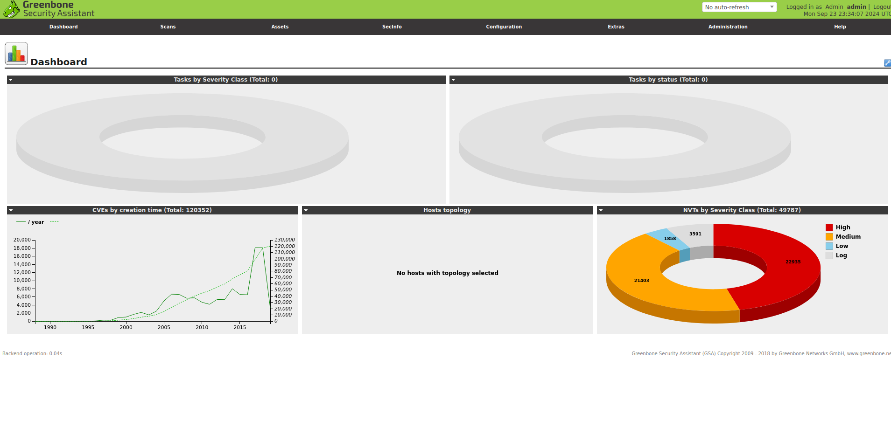
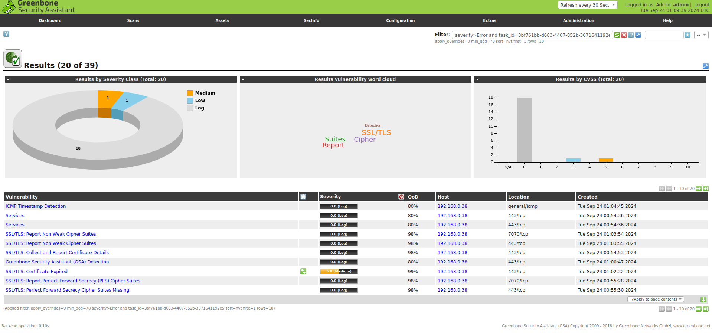
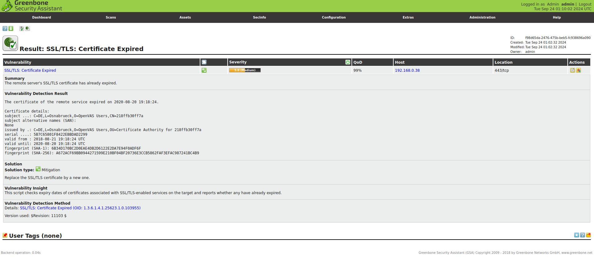

# Criptografia y Seguridad en Redes

## Trabajo Practico 6 - OpenVAS

### Integrantes:

- Gil Cernich, Manuel
- Mayorga, Federica

---


## OpenVAS

OpenVAS es un escáner de vulnerabilidades de código abierto que se utiliza para escanear sistemas y redes en busca de vulnerabilidades. Es un fork de la herramienta Nessus, que era de código cerrado y se convirtió en una herramienta de pago. Tiene una interfaz web que permite a los usuarios configurar, lanzar y revisar escaneos y generar informes.

Para su instalacion se utilizo la imagen de docker `mikesplain/openvas` que ya tiene instalado OpenVAS y Greenbone Security Assistant (GSA) que es la interfaz web de OpenVAS.

```bash
sudo docker run -d -p 443:443 --name openvas mikesplain/openvas
```

Una vez que el contenedor esta corriendo, se puede acceder a la interfaz web de OpenVAS en `https://localhost:443` con el usuario `admin` y la contraseña `admin`.

<p align="center">
    <br>
    <em>Fig 1. Dashboard principal.</em>
</p>

### Escaneo de vulnerabilidades

Para realizar un escaneo de vulnerabilidades, nos dirijimos a la seccion de "Scans" y seleccionamos "Tasks". Luego, hacemos click en "Create Task" y le establecemos la IP del host a escanear.

<p align="center">
    <br>
    <em>Fig 2. Dashboard despues de un escaneo.</em>
</p>

Una vez terminado podemos ver el reporte en el mismo dashboard, para este caso solo se detecto un certificado de SSL vencido. Y el mismo OpenVAS nos da una solucion para resolverlo, que es simplemente renovar el certificado.

<p align="center">
    <br>
    <em>Fig 3. Certificado SSL vencido.</em>
</p>
