# Criptografia y Seguridad en Redes

## Trabajo Practico 7 - Wordpress

### Integrantes:

- Cabrera, Augusto Gabriel
- Gil Cernich, Manuel
- Mayorga, Federica

---
## Marco Teorico

### LAMP

LAMP es un acrónimo que se refiere a un conjunto de software utilizado comúnmente para desarrollar y ejecutar aplicaciones web dinámicas. Cada letra de "LAMP" representa un componente clave:

- **L**: **Linux** – Sistema operativo (puede ser cualquier distribución de Linux como Ubuntu, Debian, etc.).
- **A**: **Apache** – Servidor web que gestiona las solicitudes HTTP y las respuestas.
- **M**: **MySQL** (o en algunos casos **MariaDB**) – Sistema de gestión de bases de datos relacional utilizado para almacenar y gestionar los datos.
- **P**: **PHP**, **Perl** o **Python** – Lenguajes de programación usados para la lógica del lado del servidor.

Un servidor LAMP es una solución de software de código abierto que se usa ampliamente para crear sitios web dinámicos y aplicaciones basadas en la web. Es conocido por su flexibilidad, escalabilidad y facilidad de implementación.


### Wordpress


**WordPress** es un sistema de gestión de contenidos (**CMS**) que permite crear y administrar sitios web de manera fácil, sin necesidad de conocimientos técnicos.

Desde su lanzamiento en **2003**, se ha convertido en la plataforma más popular para la creación de sitios en línea. Gracias a su sistema sencillo e intuitivo, puedes crear desde un blog personal hasta la web más compleja.

Si tú también quieres o tienes un sitio en WordPress, ¡dale el mejor alojamiento con un hosting especializado! 😉

### ¿Qué es el plugin WooCommerce?

**WooCommerce** es un plugin de WordPress que permite la creación de tiendas virtuales de código abierto.

Es muy común que las empresas que ya tienen sitios en WordPress elijan WooCommerce para administrar su **ecommerce**.

La idea fue desarrollada originalmente por los programadores **Mike Jolley** y **James Koster** en **2011**. Cuatro años después, fue adquirida por WordPress y, actualmente, posee el **26%** de todas las tiendas virtuales en el mundo.

Después de todo, WooCommerce te permite vender cualquier tipo de producto o servicio, desde artículos duraderos hasta infoproductos y suscripciones de contenido.

#### Métodos de pago

WooCommerce tiene integraciones con las más variadas formas de pago, tales como:

- Tarjeta de crédito
- Tarjeta de débito
- Transferencia electrónica
- PagoSeguro
- Mercado Pago
- PayPal
- Entre otros

Por lo tanto, una vez que el cliente quiera comprar tu oferta, elegir su método de pago preferido no será un problema.


--- 


## Desarrollo

#### Instalar un entorno LAMP en las computadoras


A continuación se detallan los pasos para instalar un entorno LAMP (Linux, Apache, MySQL/MariaDB, PHP) en Ubuntu.

##### Paso 1: Actualizar los paquetes
Primero, se debe actualizar el sistema para asegurarse de que todos los paquetes estén actualizados. Ejecute los siguientes comandos:

```bash
sudo apt update
sudo apt upgrade
```

##### Paso 2: Instalar Apache
Apache es el servidor web necesario para el entorno LAMP. Para instalarlo, use el siguiente comando:

```bash
sudo apt install apache2
```

Una vez instalado, puede verificar que Apache está funcionando accediendo a `http://localhost` en su navegador.

<p align="center">
  <a href="https://example.com/">
    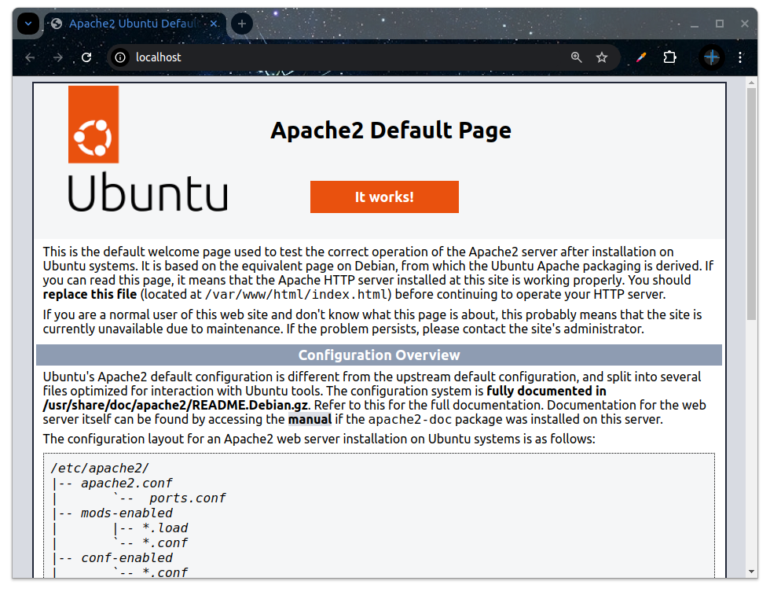
  </a>
  </p>

##### Paso 3: Instalar MySQL o MariaDB
A continuación, instalaremos MariaDB (una bifurcación de MySQL) como base de datos. Ejecute el siguiente comando:

```bash
sudo apt install mariadb-server mariadb-client
```

Para asegurar la instalación, es recomendable ejecutar el siguiente comando de seguridad:

```bash
sudo mysql_secure_installation
```

##### Paso 4: Instalar PHP
PHP es el lenguaje de programación necesario para el entorno LAMP. Instálelo utilizando el siguiente comando:

```bash
sudo apt install php libapache2-mod-php php-mysql
```

Para verificar que PHP está funcionando correctamente, cree un archivo de prueba en el directorio `/var/www/html/`:

```bash
sudo nano /var/www/html/info.php
```

Dentro del archivo, añada el siguiente contenido:

```bash
<?php
phpinfo();
?>
```

Luego, guarde el archivo y acceda a http://localhost/info.php en su navegador para verificar la instalación de PHP.

<p align="center">
  <a href="https://example.com/">
    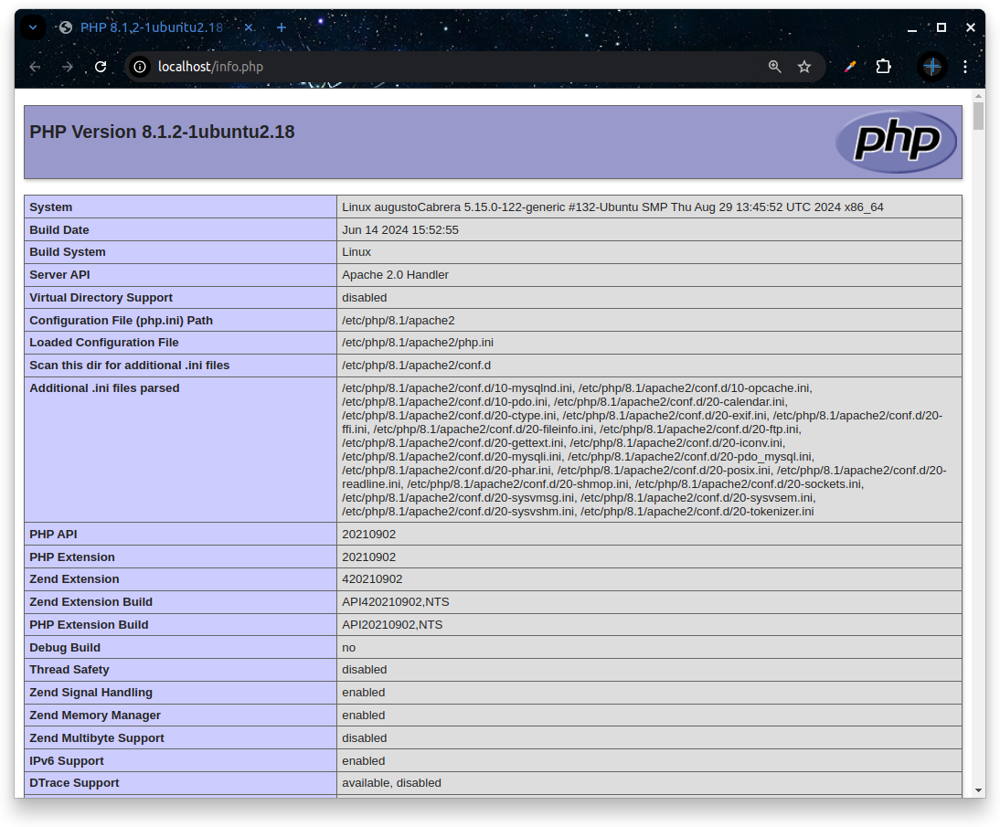
  </a>
  </p>


##### Paso 5: Reiniciar Apache
Después de instalar PHP, reinicie Apache para que los cambios surtan efecto:

```bash
sudo systemctl restart apache2
```


### Instalar WordPress y añadir plugins de seguridad

Ya que estás en Ubuntu con LAMP configurado, sigue estos pasos para instalar WordPress:

##### a. Descargar WordPress

```bash
cd /var/www/html
sudo wget https://wordpress.org/latest.tar.gz
sudo tar -xzvf latest.tar.gz
sudo mv wordpress/* .
sudo rm -rf wordpress latest.tar.gz
```

##### b. Asignar permisos

```bash
sudo chown -R www-data:www-data /var/www/html
sudo chmod -R 755 /var/www/html
```

<p align="center">
  <a href="https://example.com/">
    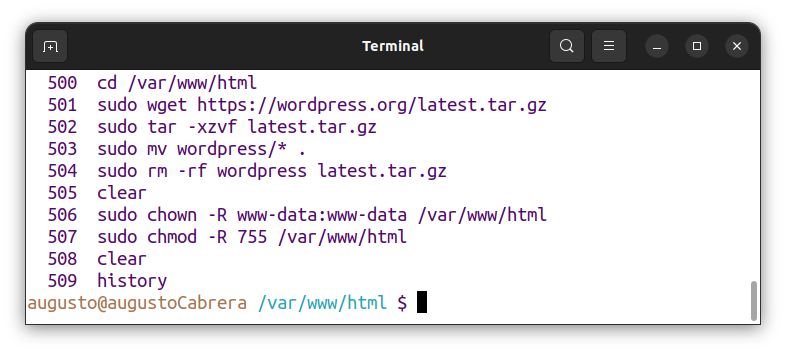
  </a>
  </p>


##### c. Configurar la base de datos

Inicia sesión en MySQL:

```bash
mysql -u root -p
```

Crea una base de datos para WordPress:

```bash
CREATE DATABASE wordpress_db;
CREATE USER 'wordpress_user'@'localhost' IDENTIFIED BY 'password';
GRANT ALL PRIVILEGES ON wordpress_db.* TO 'wordpress_user'@'localhost';
FLUSH PRIVILEGES;
EXIT;
```


<p align="center">
  <a href="https://example.com/">
    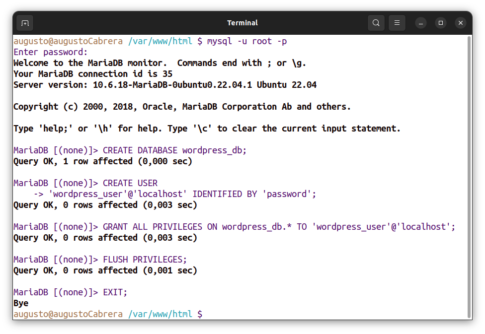
  </a>
  </p>


##### d. Configurar WordPress

Copia el archivo de configuración predeterminado:

```bash
cp wp-config-sample.php wp-config.php
```

Edita wp-config.php:

```bash
sudo nano wp-config.php
```

Rellena los datos de la base de datos:

```bash
define( 'DB_NAME', 'wordpress_db' );
define( 'DB_USER', 'wordpress_user' );
define( 'DB_PASSWORD', 'password' );
define( 'DB_HOST', 'localhost' );
```

##### e. Finalizar instalación a través del navegador

Visita http://localhost en tu navegador y sigue el asistente para completar la instalación.

<p align="center">
  <a href="https://example.com/">
    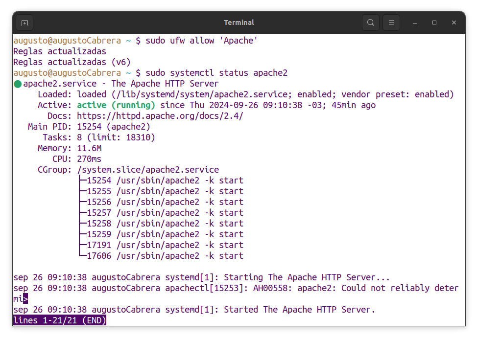
  </a>
  </p>

<p align="center">
  <a href="https://example.com/">
    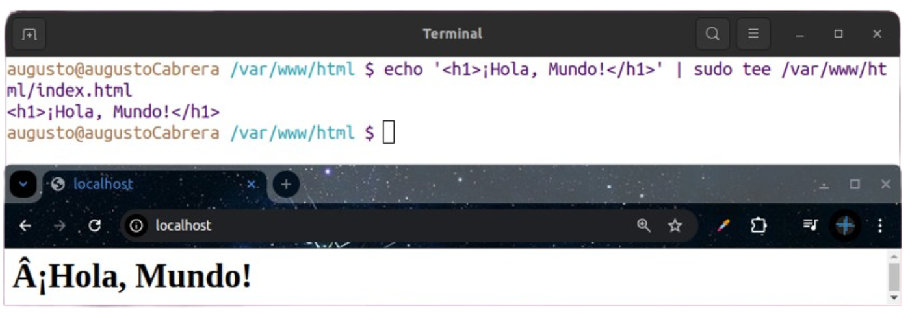
  </a>
  </p>


##### a. Instalar Wordfence

<p align="center">
  <a href="https://example.com/">
    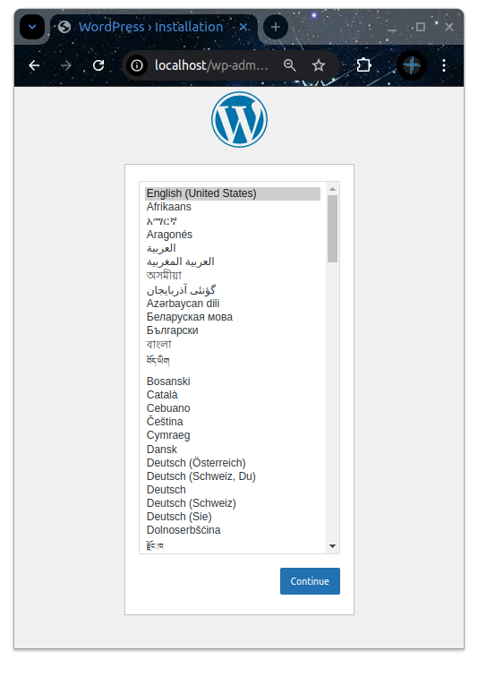
  </a>
  </p>

<p align="center">
  <a href="https://example.com/">
    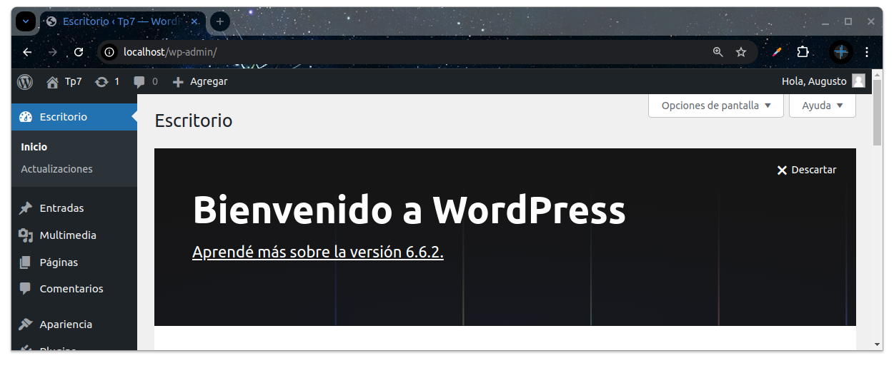
  </a>
  </p>

- Inicia sesión en el panel de WordPress.
- Ve a `Plugins > Añadir nuevo`.
- Busca `Wordfence`.

<p align="center">
  <a href="https://example.com/">
    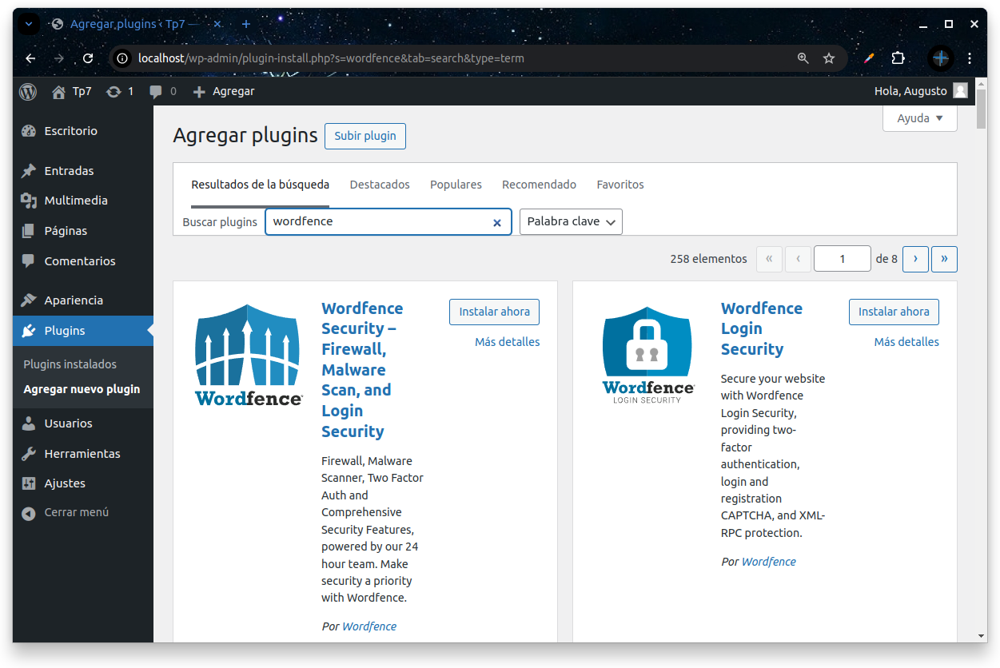
  </a>
  </p>


- Haz clic en `Instalar ahora` y luego en `Activar`.

<p align="center">
  <a href="https://example.com/">
    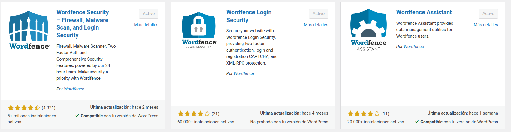
  </a>
  </p>

<p align="center">
  <a href="https://example.com/">
    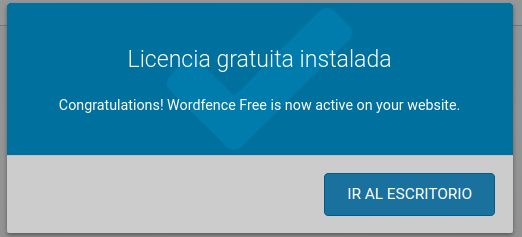
  </a>
  </p>


##### b. Revisar configuración predeterminada


  - Ve a `Wordfence > All Options`.
- Revisa las configuraciones importantes:
  - **Brute Force Protection:** Habilita bloqueo de intentos de inicio de sesión fallidos.
  - **Firewall:** Configura el firewall de Wordfence para que esté en `Extended Protection`.
  - **Live Traffic:** Decide si quieres monitorear el tráfico en vivo.
  - **Alerts:** Asegúrate de que las notificaciones importantes estén habilitadas para recibir alertas por correo.


Estos ajustes predeterminados ofrecen una buena protección básica, pero puedes personalizarlos según tus necesidades.


### Instalar uno o más de los siguientes plugins
- WooCommerce
- Yoast SEO
- Contact Form 7
- W3 Total Cache
- PublishPress Capabilities
- Smash Balloon Social Post Feed

<p align="center">
  <a href="https://example.com/">
    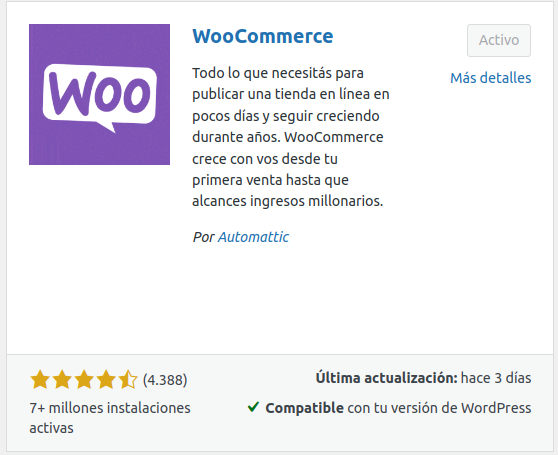
  </a>
  </p>

<p align="center">
  <a href="https://example.com/">
    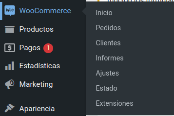
  </a>
  </p>


<p align="center">
  <a href="https://example.com/">
    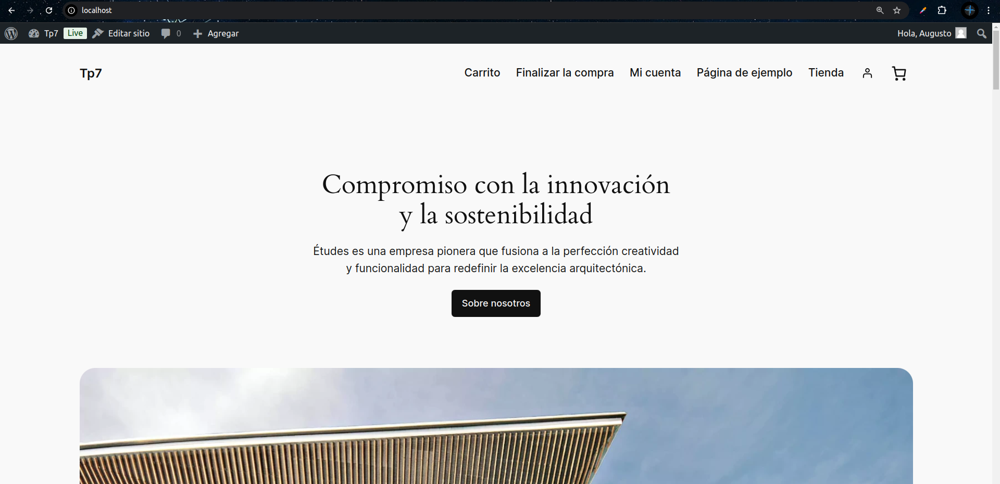
  </a>
  </p>


### Exponer la instalación a internet y compartir la URL

#### 1 - Abrir el puerto necesario.

Para que la instalación de WordPress sea accesible desde internet, debes asegurarte de que los puertos necesarios estén abiertos.

```bash
sudo ufw allow 80/tcp
sudo ufw allow 443/tcp
sudo ufw reload

```

En tu router:
Accede a la interfaz de administración de tu router (normalmente a través de http://192.168.1.1 o http://192.168.0.1).
Busca la sección de "Port Forwarding" o "NAT" y redirige el tráfico del puerto 80 y 443 a la dirección IP local de tu máquina Ubuntu.

<p align="center">
  <a href="https://example.com/">
    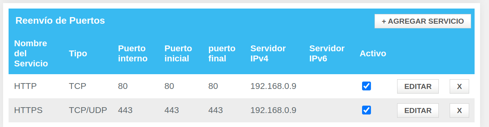
  </a>
  </p>


#### 2 - Instalar un cliente de DNS dinámico.

Algunos ejemplos son No-IP, Dynu, o DuckDNS


<p align="center">
  <a href="https://example.com/">
    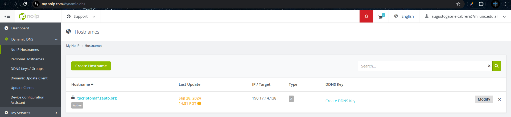
  </a>
  </p>

<p align="center">
  <a href="https://example.com/">
    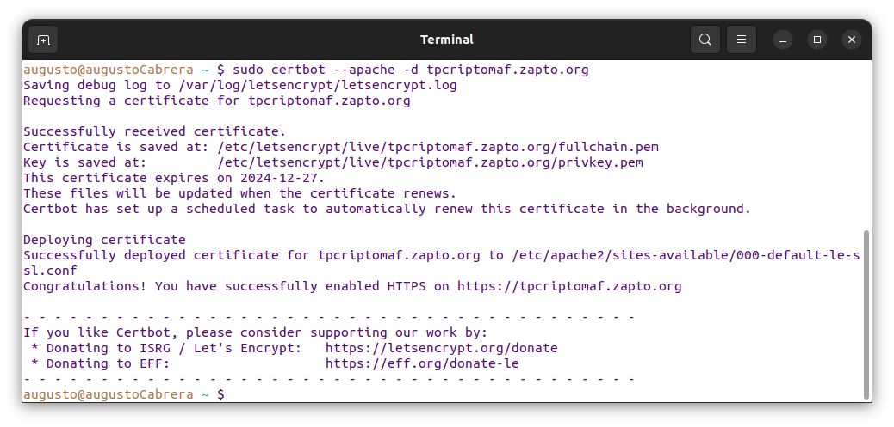
  </a>
  </p>


Al obtener y configurar el certificado SSL para tu dominio, lograste lo siguiente:

1. **Conexión Segura**: 
   - EL sitio web ahora está protegido con HTTPS, cifrando la información entre el servidor y el navegador del usuario. Esto ayuda a prevenir ataques como el "hombre en el medio" (MITM) y garantiza que los datos sensibles se transmitan de forma segura.

2. **Confianza del Usuario**: 
   - Los usuarios verán un candado en la barra de direcciones, lo que les da confianza al saber que su conexión es segura. Esto es especialmente importante si tu sitio maneja información confidencial.

3. **Mejora del SEO**: 
   - Los motores de búsqueda, como Google, favorecen los sitios que utilizan HTTPS, lo que puede mejorar la clasificación de tu sitio en los resultados de búsqueda.

4. **Cumplimiento de Normativas**: 
   - Si tu sitio recopila información personal, usar HTTPS puede ser un requisito para cumplir con normativas de protección de datos, como el GDPR en Europa.

5. **Renovación Automática**: 
   - Certbot ha configurado una tarea programada para renovar automáticamente tu certificado, reduciendo la carga de mantenimiento y evitando interrupciones en el servicio debido a un certificado caducado.

6. **Facilidad de Configuración**: 
   - Usar Certbot para configurar el certificado SSL simplifica el proceso, ya que maneja la mayoría de las configuraciones necesarias de forma automática.


#### 3 - Asignar una IP LAN fija a la máquina.

Es importante que el servidor tenga una dirección IP local estática para que las reglas de reenvío de puertos funcionen correctamente.


#### 4 - Generar un dominio.

El dominio `https://tpcriptomaf.zapto.org/`, que incorpora las iniciales de los integrantes del grupo (M.A.F), ha sido exitosamente implementado con un certificado SSL que garantiza la seguridad en las comunicaciones. Este proceso no solo permite el acceso seguro a nuestro sitio web, sino que también refleja la importancia de las configuraciones adecuadas de red y de servidor para lograr una presencia en línea efectiva y confiable.


<p align="center">
  <a href="https://example.com/">
    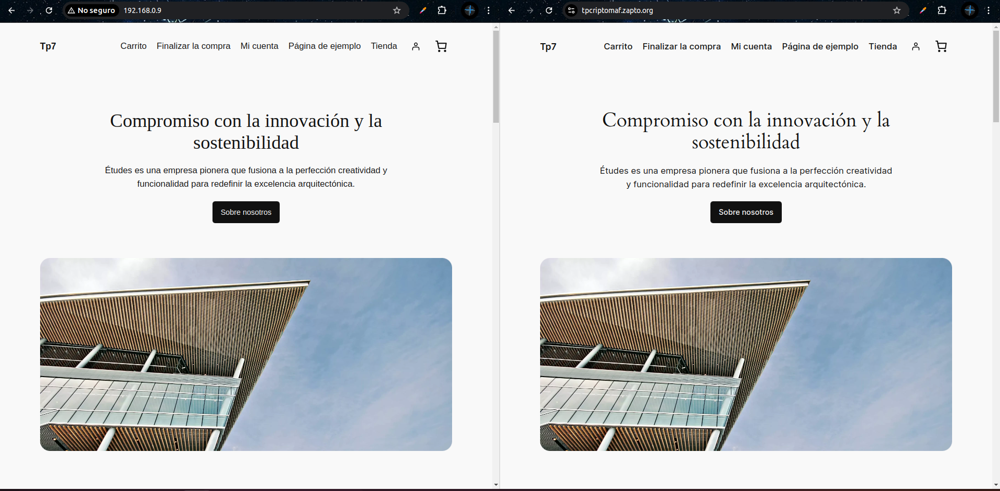
  </a>
  </p>


La creación del dominio  ha sido posible gracias a la utilización del servicio de DNS dinámico proporcionado por No-IP. Este proceso se ha llevado a cabo en varios pasos clave:

1. **Registro del Dominio**: Se ha registrado el dominio en No-IP, asignando la dirección IP pública de nuestro servidor, lo que permite que el dominio apunte correctamente a nuestra máquina.

2. **Configuración del Router**: Se realizó la configuración del reenvío de puertos en el router, asegurando que las solicitudes entrantes en los puertos 80 (HTTP) y 443 (HTTPS) se dirijan a la dirección IP local de nuestro servidor (192.168.0.9).

3. **Instalación de Certbot**: Se utilizó Certbot para obtener un certificado SSL gratuito de Let's Encrypt, permitiendo la habilitación de HTTPS en nuestro dominio.

4. **Redirección de HTTP a HTTPS**: Se configuró Apache para redirigir automáticamente las solicitudes de HTTP a HTTPS, asegurando que todas las conexiones se realicen de manera segura.

5. **Verificación de Certificado**: Se llevó a cabo una verificación simulada de renovación del certificado, confirmando que todo estaba configurado correctamente y que el certificado se renovaría automáticamente.


