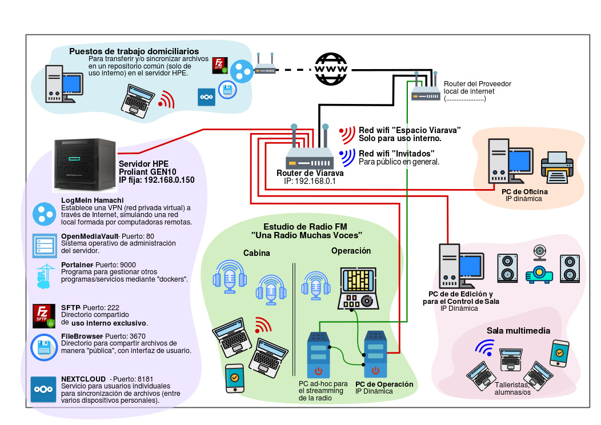

# Criptografia y Seguridad en Redes

## Trabajo Practico 9 - Análisis de una infraestructura real

### Integrantes:

- Cabrera, Augusto
- Gil Cernich, Manuel
- Mayorga, Federica

---

## Objetivo 
En el presente laboratorio revisaremos la infraestructura de una radio real. 
Debemos presentar un informe con un análisis y propuesta de mejoras. El mismo será realizado identificando componentes críticos, como elementos de protección incorporados, elementos de protección que podrían incorporarse y si es viable o no. 
Analizar:
  - La infraestructura de red y su arquitectura 
  - Los nodos y sus sistemas operativos. 
  - Las aplicaciones instaladas y las posibilidades de asegurarlas.

Para cada caso, anotar: 

**¿Que herramientas de autorización y autenticación se podrían implementar?**

**¿Que otras herramientas podrían agregarse para asegurar el sistema?**

**¿Que bugs o errores puede tener cada uno de estos dispositivos o aplicaciones?**

---
Se presenta un esquema visual de la organizacion en su estado actual.

     
    <em>Fig 1. Diagrama de la organizacion.</em>

### Finalidad pretendida:
"Queremos utilizarlo como servidor de la red interna (como repositorio para compartir archivos entre las computadoras conectadas por cable a la misma red y con las netbooks que accedan vía wifi), y para sincronización de archivos con PC’s domiciliarias (al modo de un Dropbox)."

### Infraestructura de red y arquitectura

Acerca de los routers mencionados, Viarava TL-WR940N y ONU XPON DN-HG8410C, este primero es el punto de acceso de entrada de internet a la organizacion, para lo cual se recomienda asegurarse de haber cambiado la contraseña predeterminada de administrador y tambien, habiliar WPA3 o WPA2 con una contraseña segura para la red Wi-Fi. En caso de ser posible, se considere segmentar la red interna en VLANs para separar asi el trafico y mejorar la seguridad.

Sobre el segundo router, al estar proporcionado por el proveedor de internet, se recomienda una contraseña segura y mantener el firmware actualizado para corregir posibles vulnerabilidades.

Para el servidor HPE ProLiant Gen10, es mas que prudente asegurarse que el sistema operativo del mismo, este actualizado y que solo los servicios que sea necesarios esten habilitados. Implementar un firewall, para asi controlar el trafico de entrada y salida, y utilizar herramientas como fail2ban para protegerse contra ataques de fuerza bruta, seria optimo.
De forma fisica, que el servidor este ubicado en un lugar seguro y que solo personal autorizado tenga acceso a el.

Por los servicios de OpenMediaVault (OMV), es recomendado tener la version actualizada y configurar los permisos adecuados para las carpetas compartidas; para Portainer, al utilizar los conteiners, procurar usar contraseñas robustas y que solo sea accedido desde la red interna. No todos los usuarios deberian tener acceso completo a todo.

Como un paso mas, se recomienda implementar autenticacion de dos factores (2FA), siempre que sea posible, como Google Authenticator o FreeOTP+, siguiendo la linea de Open Source (OS).

### Red semipublica

Para la red semi publica, se considere posible, utilizar un servidor proxy inverso. Este actua como un intermediario entre los clientes (los navegadores) y el servidor. Su funcion principal es recuperar recursos en nombre del cliente, y recibir la solicitud. Actua como un escudo, ocultando la infraestructura y filtrando las posibles amenazas.

Tambien, establecer politicas de acceso, basadas en roles, para limitar a quienes pueden tener acceso a que recursos. Asi como configurar copias de seguridad automaticas, y la restauracion de las mismas.

### Ancho de banda

Para lograr limitar el ancho de banda en la red semipublica (para alumnes y docentes), se recomienda configurar Quality of Service (QoS) en el router, y asi priorizar el streaming de la radio y limitar los otros usos. Acompañandolo de establecer horarios especificos para las actividades educativas y asi ajustar las restricciones en el ancho de banda, en consecuencia. 

El QoS es en realidad un cnonjunto de macanismos que se utilizan para controlar el trafico y poder asi, priorizar. Asegurandose que las aplicaciones mas importantes reciban el ancho de banda necesario, y experimentar una latencia minima. Mediante el marcado de los paquetes (como voz, video, datos, etc), y a los routers crearles colas virtuales separadas por tipo de trafico. Sera el administrador quien decida como se manejaran los parquetes en funcion de la prioridad que se les condigure.

### Servicio de streaming de la radio

En este area, se recomienda agregar una placa de sonido al servidor, para que luego se pueda configurar un software de streaming (como Ampache o AltaCast, ambas de OS) para transmitir directamente desde el servido, y asi eliminar la necesidad de tener una PC en el estudio de la radio con este proposito.

### Sistema de Backups programados

Implementar un sistema de backups programados en el servidor, es una idea recomendable para mantener seguros los datos de la radio. Siguiendo con la postura de utilizar software de OS, se podria aplicar Duplicity que funciona completamente desde la linea de comandos (acompañado de una capacitacion para las personas que esten a cargo del servidor), ya que realiza copias de seguridad incrementales en formato `.tar`, tanto en el servidor local como en un servidor remoto. Admite distintos protocolos de sincronizacion, utiliza rsync lo cual ahorra ancho de banda e implementa encriptacion de los archivos, lo cual garantiza que las copias de seguridad sean seguras.